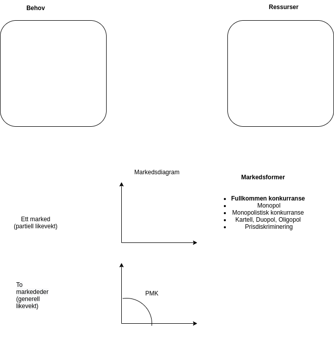
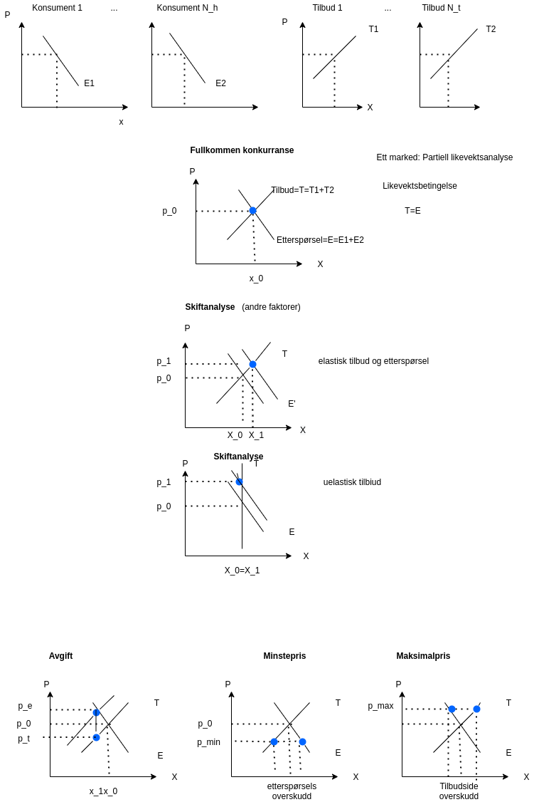

# Forelesning 1

## DEL 1: INNLEDNING

### Litt om samfunnsøkonomi og mikroøkonomi som fag

### Om kurset

### Litt mer om samfunnsøkonomi og mikroøkonomi som fag

Alternativkostnad

### Introduksjon til mikroøkonomi: En markedsmodell med fullkommen konkurranse

Produksjonen og etterspørsel skjer ved hjelp av et marked

-   Beslutningene er destraliserte

Lenke til video

Planøkonomi: staten produserer varer og tjenester

-   Beslutningene er sentraliserte

# 

[Om markedsmekanismen](https://www.youtube.com/watch?v=67tHtpac5ws)
