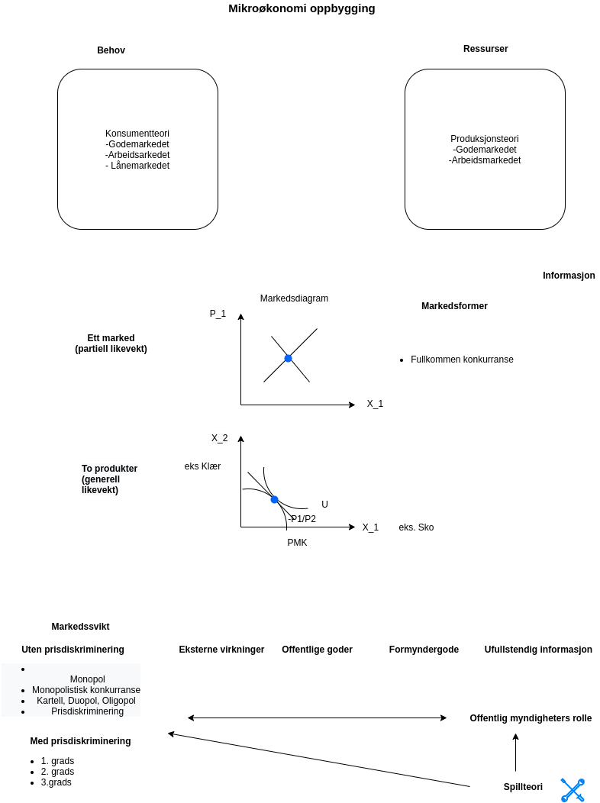

# Forelesning 13: Praktisk informasjon før eksamen og siste repetisjonsforelesning (opptak)

**Dagens forelesning**

## Praktisk informasjon før eksamen

1.  Tips og råd til eksamen

    1.  Oppgaver fra regneverkstedene
    2.  Arbeidskrav
    3.  Anbefalte oppgaver
    4.  Tidligere eksamensoppgaver

Insperia: samme oppsett som vi hadde i makro.

-   Docx-dokument (forklaringer med tekst)

-   Figurer og utregninger (skrives med penn og papir, skannes, lastes opp til besvarelsen)

-   Lever for sent: sende besvarelsen til eksamenskontoret med en kort forklaring på hva som gikk galt.

-   

    2.  Innlevering av arbeidskrav

    

-   Office hours: Digitalt før eksamen: Onsdager 12:15-15:00

    . første halvdel: egner seg i plenum

    -   Andre halvdel

    -   

-   Spørsmål og svar (Canvas)

## Siste repetisjonsforelesning (videooptak)

