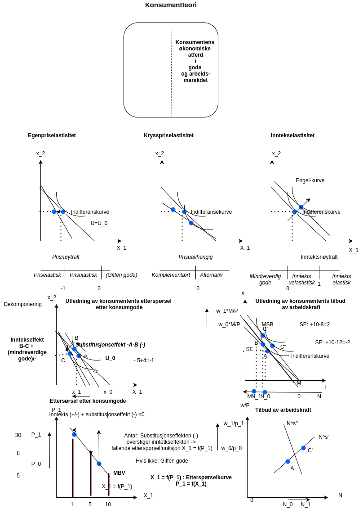

# Forelesning 6

***Tilbake 14:15***

## DEL 3: KONSUMENTTEORI: Konsumentens tilpasning i gode- og arbeidsmarkedet

Prisen går ned med et vist kronebeløp?

Prisen går ned med en viss prosentats?

Elastisiteter

$e_{ij} \equiv \frac{\frac{\Delta X_{i}}{X}_{1}}{\frac{\Delta P{j}}{P_{j}}}=\frac{\Delta X_{i} P_{j} }{\Delta P_{j} X_{i}}$

Kvantumsendring i prosent

$$
\frac{\Delta X_{1}}{X_{1}}
$$

Prisendring i prosent

$$
\frac{\Delta P_{1}}{P}
$$

### Egenpriselastisitet

$e_{11} \equiv \frac{\frac{\Delta X_{1}}{X}_{1}}{\frac{\Delta P{1}}{P_{1}}}=\frac{\Delta X_{1} P_{1} }{\Delta P_{1} X_{1}}$

### Krysspriselastisitet

$e_{12} \equiv \frac{\frac{\Delta X_{1}}{X}_{1}}{\frac{\Delta P{2}}{P_{2}}}=\frac{\Delta X_{1} P_{2} }{\Delta P_{2} X_{1}}$

### Inntektselastisitet

$e_{1y} \equiv \frac{\frac{\Delta X_{1}}{X}_{1}}{\frac{\Delta Y}{Y}}=\frac{\Delta X_{1} Y }{\Delta Y X_{1}}$

### Utledning av etterspørselsfunksjonen etter konsumgoder

### Utledning av tilbudsfunksjonen etter arbeid (øvelse til neste gang)

Budsjettbetingelsen

$$
px = wN\\
N = M-L \\
px = w(M-L) \\
px =wM -wL \\
px+wL = wM  
$$

Nyttefunksjonen består derfor av konsumgode (x) og fritid (L) $$
U=u(x,L) \text{ } u'x >0, u''x<0,   u'F > 0, u''F < 0
$$

### Øvelse til neste gang

### Utledning av tilbudsfunksjonen etter arbeid

### Oppgave som blir gjennomgått i neste forelesning (24/2)

Optimal løsning er kjennetegnet ved

$$
MSB = \frac{p_{1}}{p_{2}}
$$

$$
MSB = \frac{U'_{1}}{U'_{2}}= \frac{2x_{2}}{(2x_{1}+1)} = p_{1}/p_{2} \\
2 p_{2}x_{2} =p_{1}(2x_{1}+1) \\ 
p_{2}x_{2} = p_{1}(x_{1}+1/2) \\ 
\text{Siden vi også har at} \\
p_{1}x_{1}+p_{2}x_{2}= m \\
\text{kan vi sette inn for } p_{2}x_{2} \\
p_{1}x_{1} + p_{1}(x_{1}+1/2) = m \\
2p_{1}x_{1} = m-p_{1}/2 \\
p_{1}x_{1} = m/2-p_{1}/4 \\
\text{Ettersporselsfunksjonen}  \\
x_{1} = \frac{m}{2p_{1}} - 1/4  \\ 
\text{Marginale betalingsvillighet (MBV)} \\
2(x_{1} + 1/4)/m = \frac{1}{p_{1}} \\
m/2(x_{1} + 1/4) = \frac{p_{1}}{1} \\
p_{1} = \frac{m}{2(x_{1} + 1/4)} \\
$$

b)  $$
    p_{1} = 26/2\cdot 4-0.25 = 4
    $$

c)  $$
    \frac{\partial  x_{1}}{\partial m_{1}} = 1/2p_{1} > 0 \text{ dvs. normal gode}
    $$
