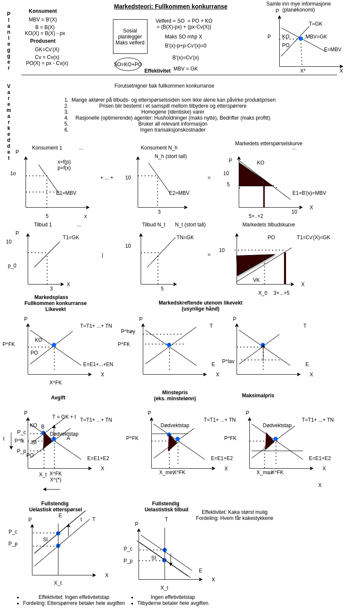
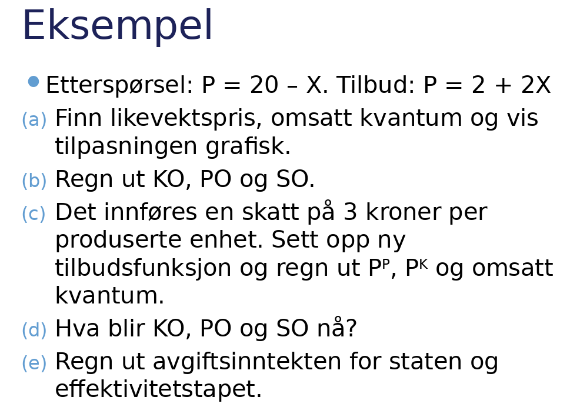
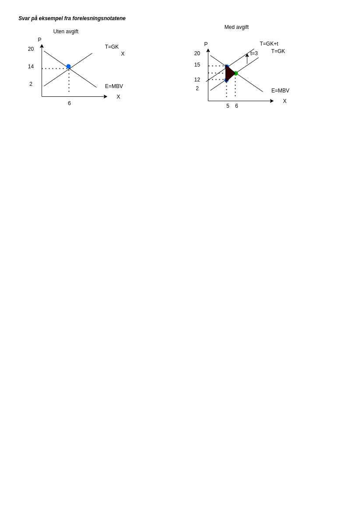

# Forelesning 7:

## DEL 4: MARKEDSTEORI: Fullkommen konkurranse

### Samfunnsøkonomisk overskudd som mål på velferd

### Markedsøkonomiens første velferdsteorem

Fullkommen konkurranse gir altså maksimalt samfunnsøkonomisk overskudd.

Dette resultatet gjelder også i generell likevekt: 1.st velferdsteorem

 Svar på eksempel fra
forelesningsnotatene

a)  

Vi starter med omsatt kvantum. I fullkommen vil løsningen være
karakterisert ved at MBV=GK, det gir oss

$$
20-x=2+2x \\
-x-2x =2-20 \\
3x   =18 \\
x^{fk}=x = 6
$$ Setter vi dette kvantumet inn i enten etterspørs- eller tilbudskurven
vil vi finne produktprisen $$
x = 6 \\
MBV: P = 20-6=14 \\
(GK: P = 2+26 = 14)
$$ b)

Konsumentoverskuddet er gitt ved arealet til trekanten

$$
KO = (6-0)\cdot(20-14)/2 = 18
$$ Mens produsentoverskudet er gitt ved $$
PO = (6-0)(14-2)/2 = 36
$$ Samfunnsøkonomisk overskudd blir derfor (dersom vi ser bort fra
skatteinntektene)

$$
SO = PO+KO =36+18=54
$$

c)  Skatt per enhet gjør at tilbudskurven kan skrives som $$
    P = 2+2x + 3
    $$ $$
    20-x=2+3+2x \\
    -x = 5+2x-20 \\
    x =  \\
    3x   =15 \\
    x = 5
    $$ Prisen blir derfor for $$
    P = 20 - 5 = 15
    $$ og for $$
    P=2+2\cdot5 = 2+10 = 12
    $$

Konsumentoverskudet er nått gitt ved $$
KO = (5*(20-15))/2 = 12.5
$$

Mens produsentoverskuddet blir $$
PO = (5*(12-2))/2 = 25
$$

Samfunnsøkonomisk overskudd er derfor

$$
SO = 12.5+25 + tX=  37.5 + tX
$$

e)  Staten

Avgiftsinntekten (SI) $$
SI = (15-12)(5-0) = 15
$$ Dødvektstapet (DT) $$
DT =((15-12)\cdot 1)/2 =  3/2 = 1,5
$$

[Friedman om
prismekanismen](https://www.youtube.com/watch?v=R5Gppi-O3a8)

[Friedman om prismekanismen
(utvidet)](https://www.youtube.com/watch?v=4ERbC7JyCfU&t=3s)
