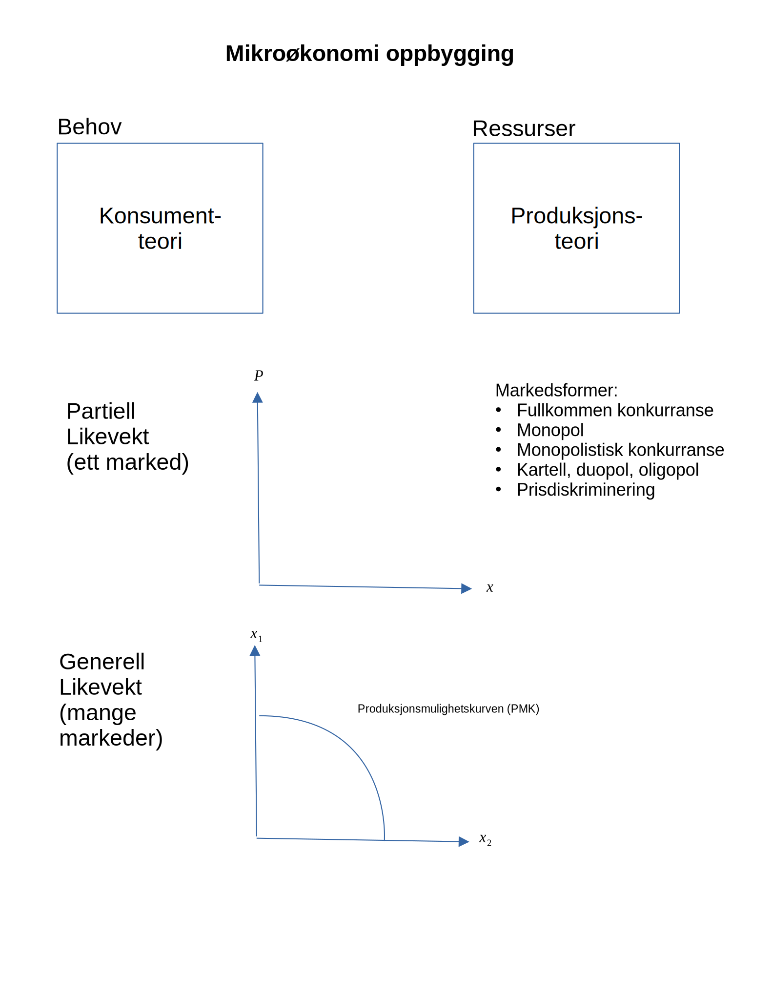
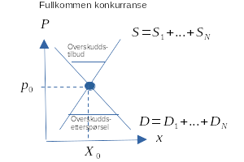
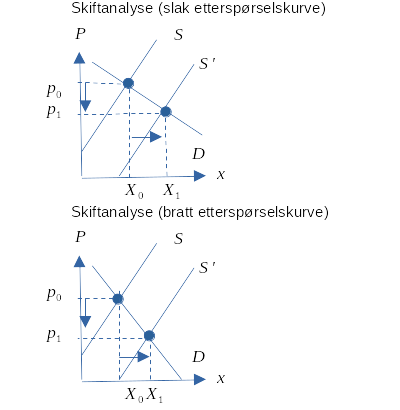
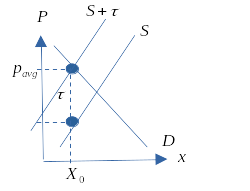
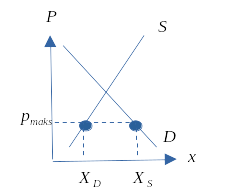
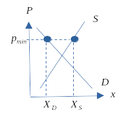
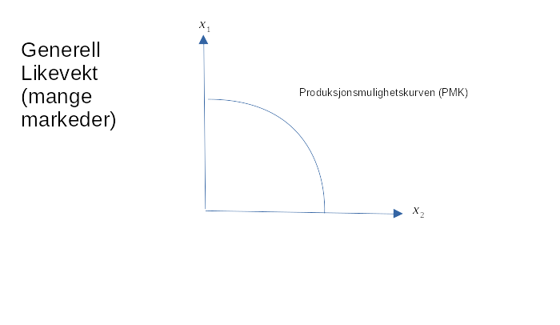
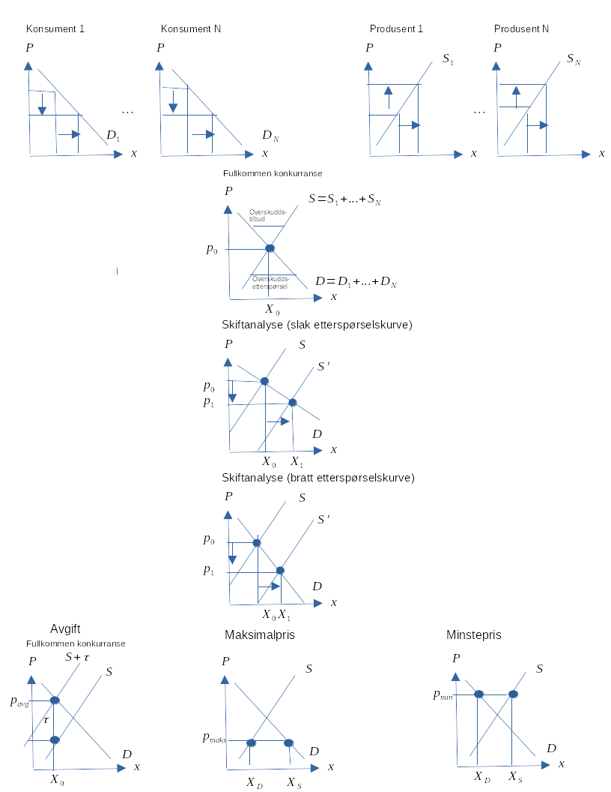

```{r xaringan-tile-view, echo=FALSE, message=F, warning=F}
xaringanExtra::use_editable(expires = 1)
xaringanExtra::use_tile_view()
#xaringanExtra::use_share_again()
xaringanExtra::use_scribble()
xaringanExtra::use_webcam()
#xaringanExtra::use_slide_tone()
xaringanExtra::use_panelset()
library(htmlTable)
library(magrittr)
library(xaringan)
library(plotly)
```

```{r eval=FALSE, include=FALSE}
#- Eksempel med $U(x_1, x_2) = 10x_1x_2$
pathn <- '/inst/forelesningsnotater/presentationsF'
xaringan::inf_mr(paste0(rprojroot::find_rstudio_root_file(),pathn,'.Rmd'))
system(paste0('brave ',rprojroot::find_rstudio_root_file(),pathn,'.html'))
servr::daemon_stop()
rmarkdown::render(paste0(rprojroot::find_rstudio_root_file(),pathn,'.html'))
```

```{r echo=FALSE, message=FALSE, warning=FALSE}
source(paste0(rprojroot::find_rstudio_root_file(),'/inst/forelesningsnotater/timeplan.R'))
```

# Timeplan med anbefalte oppgaver

```{r, eval=T, echo=F}
df1_i <- df1[1:6,]
kableExtra::kbl(df1_i) %>% kableExtra::kable_paper(full_width = F) %>% kableExtra::kable_styling(font_size=12)

```

---

```{r, eval=T, echo=F}
df1_ii <- df1[c(7:11),]
kableExtra::kbl(df1_ii) %>% kableExtra::kable_paper(full_width = F) %>% kableExtra::kable_styling(font_size=12)
```


---

# Pensumliste 

.pull-left[

## Hovedbok


```{r, echo=FALSE, out.width="75%", fig.cap=""}
knitr::include_graphics("pensum.jpg")
```

[(Andreassen, Bredesen og Thøgersen)](https://www.cappelendammundervisning.no/_innforing-i-mikrookonomi-9788202640521)

]

.pull-right[

## Oppgavebok


```{r, echo=FALSE, out.width="25%", fig.cap=""}
knitr::include_graphics("oppgaver.jpg")
```

[(Andreassen, Bredesen og Thøgersen)](https://www.cappelendammundervisning.no/_innforing-i-mikrookonomi-ovingsoppgaver-med-losningsforslag-9788202656485)

]


```{r, eval=T, echo=F}
#knitr::kable(df2)
```

---

# Kursgodkjennelse

Består av to obligatorisk arbeidskrav (som må være bestått) for å kunne gå opp til skriftlig eksamen. 

## Obligatorisk innleveringsoppgaver

**Første arbeidskrav**
Utlevert:
Innleveringsfrist: 25. september

**Andre arbeidskrav**
Utlevert:
Innleveringsfrist: 30. oktober

## Eksamen

Eksamen avholdes den **.**.

Individuell, skriftlig firetimers eksamen.

Karakterregel: A-F.

Hjelpemidler: Godkjent kalkulator.

---

class: inverse, center, middle

# Kapittel 1: `r tema[1]`

`r paste("Oppdatert:",Sys.Date())`

---

## Hva handler økonomi om?

- Hva handler økonomi om?
- Mikroøkonomi er en del av samfunnsøkonomi. Hvilke temaer forbinder du med samfunnsøkonomi?
- En kort historie om en tur i butikken.
 - Hvilke varer skal du kjøpe?
 - Hvor mye skal du kjøpe av de ulike varene?
- Hva har økonomi med dette å gjøre? Tre relevante forhold:
 - (i) Varene må ha blitt produsert.
 - (ii) Du må tilby noe for å bytte til deg varer. Betalingsmiddel
 - og handel.
 - (iii) Du må ha skaffet betalingsmiddelet.

---

**Altså ...**

- Selv i den «enkle» historien er det:
 - Flere beslutninger involvert.
 - Flere markeder involvert.

- Men: hvorfor får vi ikke alle varer vi vil ha? Rundt oss ser vi (og opplever selv) stor etterspørsel.Vi trenger jo en rekke ting, også i Norge.
	- Svaret er: KNAPPHET!

---

## Definisjon

- Definisjon av økonomi:

*Handler om bruken av knappe ressurser for å dekke menneskelig behov.*

- Den delen av samfunnsvitenskapene som studerer de valgene som individer, bedrifter, myndigheter og samfunn må ta, som følge av knapphet.
- To stikkord: behov og ressurser. Komme tilbake til…
- Bedriftsøkonomi og samfunnsøkonomi: Hvorfor skal dere lære samfunnsøkonomi på dette studiet? Relevant for bedrifter?

---

## Behov

- Økonomers behandling av behov og behovsdannelse. For enkelt? Psykologers behandling av samme tema…
- Et grovt skille:
 - Som må dekkes
 - Ønsker
- Behov avdekkes gjennom preferanser, som igjen kan avdekkes via etterspørsel.
- Kan behov skapes? Jepp. Men er slike skapte behov mer eller mindre viktig enn ”andre” behov, gitt knappe ressurser.
- En måte å skjære gjennom denne problemstillingen på er å legge til grunn *konsumentsuverenitet*.
- ”Folk vet best selv hva som er best for dem”.

---

## Ressurser

- Innsatsfaktor eller produksjonsfaktor kan betegnes som synonyme ord.
<br> $\Rightarrow$ Faktorer som er ”input” i produksjonsprosessen.
- Kategorier:
 - Naturressurser: Fornybare og ikke-fornybare
 - Arbeidskraft
 - Realkapital: Kan brukes direkte eller indirekte
- Ressurser som er KNAPPE.
- Er penger ressurser??

---

## Så kjernen i økonomifaget er dermed:

- Ettersom det er knapphet på ressurser kombinert med store behov, er det ønskelig å bruke ressursene smartest mulig.
<br> $\Rightarrow$  Sikre at utnyttelsen av ressursene er optimal.

- Merk at ressurser ofte har alternativ anvendelse. Dette innebærer at dersom vi bruker en ressurs til å produsere en vare, kan ikke den samme ressursen brukes samtidig til å produsere en annen vare. Av og til ikke i det hele tatt.

---

## Alternativkostnad

- Dette er et helt sentralt begrep i økonomifaget.
- Bruk av ressurser tilfører en verdi som skal dekke menneskelige behov.
- Ressurser har en alternativ anvendelse. Den beste alternative anvendelse har også en verdi. Denne verdien tapes når vi bruker ressursen til et bestemt formål.
- Dette tapet er alternativkostnaden.
  - *Alternativkostnaden er altså verdien av beste alternative anvendelse.*

```{r, echo=FALSE, out.width="45%", fig.cap=""}
knitr::include_graphics("drawio/alternativ.svg")
```

---

## To sentrale spørsmål: spørsmål 1

- (1): Hvordan vil ulike valg bestemme hvilke goder som produseres, hvordan de produseres og for hvem?
 - Goder skal dekke behov og ønsker.
 - Men hva skal vi produsere og hvordan vet vi det?
 - Hvor mye skal produseres?
 - Hvordan? Vil ny teknologi erstatte arbeidskraft og føre til økt arbeidsledighet?
 - Hvem skal det produseres til? Inntektsulikhet.

---

## To sentrale spørsmål: spørsmål 2

- (2): Er det slik at valg som fremmer egeninteresse også fremmer samfunnets beste?
 - Brukes de knappe ressursene på best mulig måte?
 - Egeninteresse: valg som er best for en selv.
 - Sosial interesse: valg som er best for samfunnet som helhet.
 - Dine valg påvirker mange og valgene er knyttet sammen. Anta at alle valgene er gjort av egeninteresse, er det mulig at resultatet også er det beste for samfunnet som helhet?
 - Adam Smith: JA. «Usynlige hånd».

---

## Økonomisk tankemåte: metodologiske tradisjoner

- Økonomifaget defineres ut i fra tema som studeres, men det er en del metodiske tradisjoner.
 1. Et valg er en avveining (trade-off). Knapphet skaper valg.
 1. Kostnad: det du må gi opp.
 1. Fordel (benefit) eller nytte: Gleden du oppnår. Preferanser.
 1. Rasjonelle valg. Bruker all tilgjengelig informasjon, og veier så sammen kostnader og fordeler.
 1. Valg på marginen. Ikke enten-eller, men hvor mye. Marginalkostnad og marginalfordel.
 1. Valg responderer på incentiver. Incentiv: Belønning eller straff som følge av valg.

---

## Økonomi som vitenskap

### Modeller

- Bruker økonomiske modeller.
- Hva er en modell? En forenklet beskrivelse av virkeligheten. Bygger pr. definisjon på forutsetninger.
- Hvorfor bruke modeller? For å kunne fokusere på ett eller noen aspekter av virkeligheten. Virkeligheten er komplisert…
- Modeller gjør at vi kan rense vekk momenter som vi tror ikke har noen spesiell innvirkning på vårt spørsmål.

---

## Økonomi som vitenskap

### Skillet mellom mikroøkonomi og makroøkonomi

- Det finnes flere måter å strukturere økonomifaget på. Disiplinen består av en rekke underområder.
- Mikroøkonomi: Søker å forklare aktørers beslutninger, tilpasning og interaksjon.
- Aktører: Bedrifter, konsumenter, markeder.
- Makroøkonomi: Søker å studere og forklare aggregerte størrelser. Økonomien under ett.
- Makroøkonomi kan deles inn i konjunkturteori og økonomisk vekst.

---

## Appendiks (alle figurene samlet)

```{r, echo=FALSE, out.width="50%", fig.cap=""}

```

```{r, echo=F,eval=F}
knitr::knit_exit()
```

---

class: inverse, center, middle

# Kapittel 3: En markedsmodell med fullkommen konkurranse

`r paste("Oppdatert:",Sys.Date())`

---

## Innledning

- Bytteøkonomi og markedsøkonomi: I en markedsøkonomi (pengeøkonomi) byttes varer *indirekte*.
- Et marked består av en tilbudsside og en etterspørselsside.
- Vi skal nå se på den enkleste markedsformen i økonomisk teori.
- Markedsformen er likevel nyttig:
  - Selvstendig analyseapparat.
  - Kan utvides langs mange dimensjoner.
  - Er samfunnsøkonomisk effektiv (hva som menes med dette skal vi bruke en del tid på senere).
  - Er en referansemodell som andre modeller og resultater kan sammenlignes mot.

---

## Bakgrunn

- Store deler av kurset vil handle om teorien bak denne modellen. MERK at oppbyggingen gir oss flere selvstendige modeller som er nyttige for økonomiske analyser.
- Modellen går langt tilbake: 
  - Adam Smith (1723-1790) $\rightarrow$ 
  - Nyklassikerne og John Stuart Mill (1806-1873) $\rightarrow$ 
  - Alfred Marshall (1842-1924) $\rightarrow$ 
  -  Paul Samuelson (1915-2009) mfl.
- Vi skal komme tilbake til forutsetningene bak denne modellen i kapittel 9.
- Men merk spesielt: Aktørene er *pristakere* og har ingen innflytelse på pris som enkeltaktør, men *summen* av aktørenes adferd bestemmer markedsprisen.

---

## Markedsetterspørsel

- Etterspørsel etter varer og tjenester. Ofte kalles varer + tjenester for goder.
- Hva bestemmer etterspørselen? Priser, inntekt med mer. 
- Etterspørselsloven:
  - Økt pris $\rightarrow$ lavere etterspørsel, alt annet konstant (cet.par.). 
  - Flere forhold holdes her konstante. Vi ser kun på endringer i prisen på varen. En endring i denne vil flytte oss langs kurven.
  - En endring i konstantene vil føre til skift i kurven.
- Fra et individs etterspørsel til markedsetterspørsel.
```{r, echo=FALSE, out.width="65%", fig.cap=""}
p1 <- paste0(rprojroot::find_rstudio_root_file(),'/inst/forelesningsnotater/drawio/ekurve.png')
knitr::include_graphics(p1)
```

---

## Markedstilbud

- Tilbud av varer og tjenester. Tilbudet utgjøres av bedriftene eller produsentene. Tilbudet er altså produksjonen.
- Hva bestemmer tilbudet? Pris på ferdigvare og innsatsfaktorer. Matematisk på tavla.
- Tilbudsloven:
  - Økt pris $\rightarrow$ økt tilbud, cet.par. Kurve.
  - Endringer i prisen på varen fører til bevegelse langs kurven.
  - En endring i konstantene fører til skift i kurven.
- Fra en bedrifts tilbud til markedstilbud.

```{r, echo=FALSE, out.width="65%", fig.cap=""}
p1 <- paste0(rprojroot::find_rstudio_root_file(),'/inst/forelesningsnotater/drawio/tkurve.png')
knitr::include_graphics(p1)
```

---

## Markedslikevekt 

- Utgangspunkt: markedets E-kurve og T-kurve.
- Likevekt: dersom ingen aktører ønsker å endre den eksisterende økonomiske tilpasning.
	-  $X^S = X^D$
	- Overskuddsetterspørsel: $X^D > X^S$
- Anta at prisen er lavere enn likevektspris (makspris).
	- Overskuddstilbud: $X^S > X^D$
- Anta at prisen er over likevektsprisen (minpris).
- Ingenting i modellen som tilsier stabilitet. Men utenfor modellen kan vi resonnere omkring markedskrefter, slik de er beskrevet av Adam Smith.

```{r, echo=FALSE, out.width="50%", fig.cap=""}

```

---

## Komparativ statikk/ skift i kurvene

- Vi vet at tilbuds- og etterspørselskurvene er konstruert under en antagelse om at flere forhold antas konstante. Dersom det skjer endringer i noen av disse forholdene, vil kurvene forskyves i diagrammet.
La oss se på noen av disse forholdene.

**Tilbudskurven**

- Ble tegnet for:
	- gitt teknologi for bedriften,
	- gitte priser på innsatsfaktorene.

**Etterspørselskurven**

- Ble tegnet for:
	- en gitt behovsstruktur for konsumenten,
	- gitt samlet inntekt for konsumenten,
	- gitt inntektsfordeling,
	- gitte priser på andre goder.

---

### Helningens betydning

- Helningen på tilbuds- og etterspørselskurven påvirker hvordan endringer i markedet påvirker pris og mengde.
La oss se på et eksempel der lavere pris på innsatsfaktorene har ført til et positivt skift i tilbudskurven.

```{r, echo=FALSE, out.width="50%", fig.cap=""}

```
---

## Effekten av en avgift

- En avgift kan ha flere hensikter, men spesielt er to ting viktig:
	i) Inntekt for staten
	ii) Endrer markedsresultatet. Aktuelt ved behov for korrigering av nåværende situasjon (tilpasning).
- Avgiften kan pålegges kjøperne og selgerne.

---

Anta nå at avgiften $\tau$ blir pålagt selgerne
- Dersom avgiften pålegges produsentene, vil
kostnadene til bedriften stige. Dette skifter isolert sett
tilbudskurven innover. Den vertikale størrelsen på
skiftet er lik avgiften $\tau$.
Resultater:
- Staten får inn $\tau$ kr. pr. enhet.
- Konsumenten betaler: $P^K$
- Produsenten mottar: $P^P$
Produsenten ”sender” nå avgiften til staten, men begge bærer byrden!!

```{r, echo=FALSE, out.width="45%", fig.cap=""}

```

---

## Maksimal- og minsteprisen

- Maksimalpris har vi dersom markedsprisen blir overtyrt ved at myndighetene setter et makspris som er *lavere* enn markedsprisen.

```{r, echo=FALSE, out.width="40%", fig.cap=""}

```

---

- Minstrepris har vi dersom markedsprisen blir overtyrt ved at myndighetene setter et minstepris som er *høyere* enn markedsprisen.

```{r, echo=FALSE, out.width="40%", fig.cap=""}

```

---

## Produksjonsmulighetskurven (PMK)

- Produksjonsmulighetskurven (PMK)
- PMK: kurven kan brukes til å illustrere hvordan produksjonsmulighetene er begrenset. Dette fører til et ressursallokeringsproblem. Videre skal vi illustrere forskjellen på kort og lang sikt.
- Kurven bygger på en antagelse om at alternativkostnadene øker ved stadige overføringer av ressurser mellom sektorer.
- Forutsetninger: to produkter, gitt mengde produksjonsfaktorer (kort sikt) og produksjonsteknologien er konstant.

```{r, echo=FALSE, out.width="60%", fig.cap=""}

```

---

## Appendiks (alle figurene samlet)

```{r, echo=FALSE, out.width="55%", fig.cap=""}

```

```{r, echo=F,eval=F}
knitr::knit_exit()
```

---

class: inverse, center, middle

# Kapittel 4: `r paste(substring(del[2],4),tema[2])`

`r paste("Oppdatert:",Sys.Date())`

---

## Innledning

- Produsentene eller bedriftene er en av hovedaktørene i en økonomi.
- Produsentens rolle: tilby de varer og tjenester som etterspørres i et samfunn. Basert på konsumentens ønsker må produsenten vite hva som skal produseres, mengde og lokalisering.
- Teknologisk perspektiv: Produsenten bruker innsatsfaktorer til å omforme råvarer til ferdige produkter.
- Vi forenkler produksjonsbildet ved å anta at produsenten bruker to innsatsfaktorer, $N$ og $K$, til å produsere ett produkt, $x$. $N$ er arbeidskraft og $K$ er realkapital.

```{r, echo=FALSE, out.width="65%", fig.cap=""}
pf <- paste0(rprojroot::find_rstudio_root_file(),'/inst/forelesningsnotater/drawio/prodbildetf.png')
knitr::include_graphics(pf)
```

- Bedriften må altså velge effektiv produksjonsprosess.

---

- Økonomisk perspektiv: Her består valget i å velge hvor mye bedriften skal produsere og tilby av produktet.
- For å kunne få størst mulig overskudd må vi kjenne til inntekter og kostnader. Kostnadene er igjen svært avhengig av det teknologiske valget.
- Vi må derfor sammenkoble elementer fra begge disse perspektivene.

---

## Produksjon og teknologiske forhold

- Vi tar utgangspunkt i produksjonsbildet med to innsatsfaktorer og ett produkt.
- Produktfunksjonen:
	- $x = 
