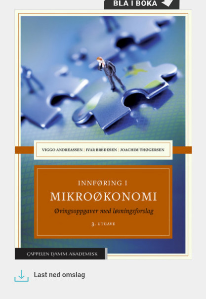

<!-- README.md is generated from README.Rmd. Please edit that file -->

# Mikroøkonomi med anvendelser (høsten 2022)

## Nyheter

-   Vi gikk litt langt fram på fredag 30.9. Har snakket med faglærerne i
    Bergen og Sogndal, og det ble klart for meg at husholdningens tilbud
    av arbeidskraft ikke er en del av pensum dette året.

### Studietips

[Generelle studietips\_ System framfor
mål.pdf](https://github.com/joernih/BOEA203Mikrooekonomi/blob/main/inst/oppgaver/systemvsmaal.pdf)

### Pensum og emneplan

   [Pensumbok
(Andreassen, Bredesen og
Thøgersen)](https://www.cappelendammundervisning.no/_innforing-i-mikrookonomi-9788202640521)
 

[Oppgavebok (Andreassen, Bredesen og
Thøgersen)](https://www.cappelendammundervisning.no/_innforing-i-mikrookonomi-ovingsoppgaver-med-losningsforslag-9788202656485)
 

[Emneplan for
kurset](https://www.hvl.no/studier/studieprogram/emne/41/b%C3%B8a203)

Undervisningsansvarlig (jornih at hvl.no)

Jørn I. Halvorsen

**Siste gang oppdatert: 2022-10-03 13:33:54**
