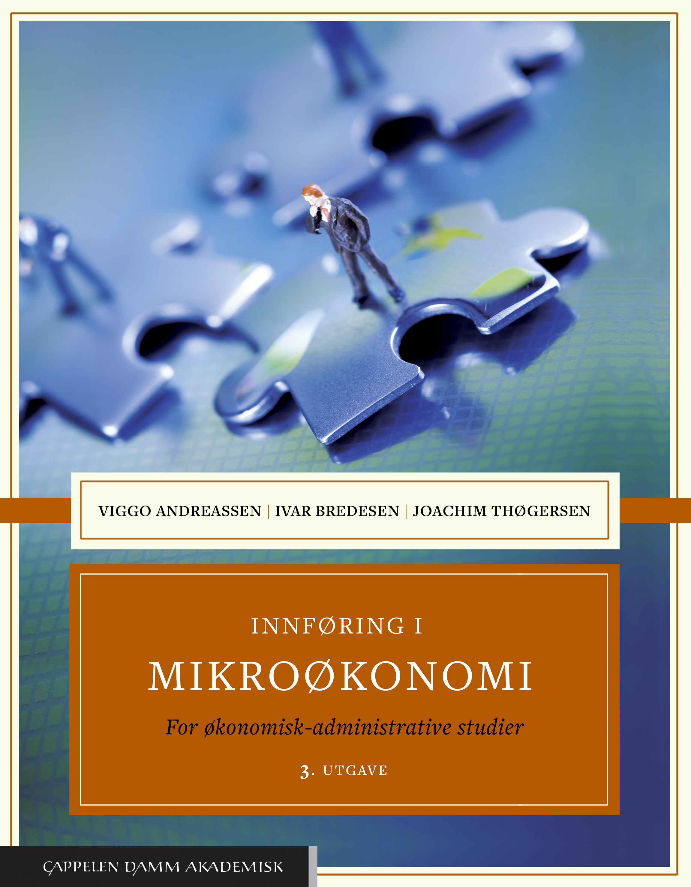

<!-- README.md is generated from README.Rmd. Please edit that file -->

# Mikroøkonomi med anvendelser (høsten 2022)

### Studietips

[Generelle studietips\_ System framfor
mål.pdf](https://github.com/joernih/SFB10816Mikrooekonomi/blob/main/inst/systemvsmaal.pdf)

### Pensum

   [Pensumbok
(Andreassen, Bredesen og
Thøgersen)](https://www.cappelendammundervisning.no/_innforing-i-mikrookonomi-9788202640521)
 

[Oppgavebok (Andreassen, Bredesen og
Thøgersen)](https://www.cappelendammundervisning.no/_innforing-i-mikrookonomi-ovingsoppgaver-med-losningsforslag-9788202656485)
 

Undervisnings- og emneansvarlig (jornih at hvl.no)

Jørn I. Halvorsen

**Siste gang oppdatert: 2022-06-09 09:47:36**
