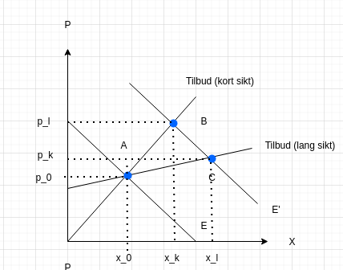
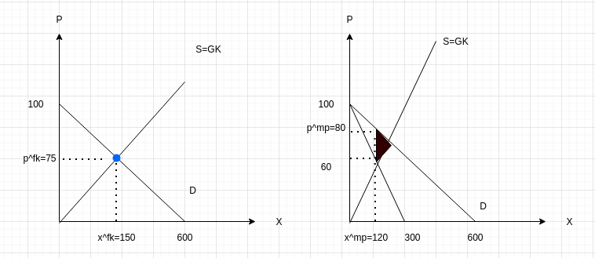

---
output:
  html_document:
  #html_notebook:
    css: PAA.css
#rnotb2 8900 $PWD arbeidskrav_losningsforslag.Rmd
---

<script type="text/x-mathjax-config">
  MathJax.Hub.Config({
    TeX: { equationNumbers: { autoNumber: "AMS" } },
  });
</script>
<style>
.mjx-mrow a {
  color: black;
  pointer-events: none;
  cursor: default;
}
</style>


<h1><center>**Eksamen**</center></h1>

<div class="losning">

<!-- <h1><center>**SENSORVEILEDNING**</center></h1> -->

</div>

<h2>**Emnekode**: SFB10816</h2> 

<h2>**Eksamensdato**: 04.05.2021</h2> 

<h2>**Målform**: Bokmål</h2> 

<h2>**Tillatte hjelpemidler**: Alle skriftlige hjelpemidler</h2> 

<h2>**Kursansvarlig**: Jørn I. Halvorsen (jorn.i.halvorsen@hiof.no)</h2>  

<h2>**Generell informasjon:**
Eksamen består av fire oppgaver. Det er mulig å svare fullstendig på alle spørsmålene gjennom korte og poengterte svar</h2>

<h2>**Merk:** Direkte sitering av tekst skal inn i referanselisten</h2>

<div class="abc">
</div>

 <P style="page-break-before: always">

# Oppgave 1: Generell forståelse (35 prosent)

1.  Nevn noen grunnleggende forskjeller mellom mikro og makroøkonomi som fag.

::: {.losning}
Mikroøkonomi: Søker å forklare aktørers beslutninger,
tilpasning og interaksjon.
Aktører: Bedrifter, konsumenter, markeder.
Makroøkonomi: Søker å studere og forklare aggregerte
størrelser. Økonomien under ett.
:::

2.  Hva menes med alternativkostnaden til en ressurs, og kan du gi noen eksempler på dette?

::: {.losning}
Alternativkostnaden er lik verdien til den neste beste andvendelsen som en ressurs har. For et jordruksareale, kan en golfbane utgjøre neste beste alternativ. En datamaskin til en arbeider, kan enten plasseres hjemme eller på kontoret. For en helesearbeider i offentlige sektor, jobb i privat klinikk.
:::

3.  Er nyttefunksjonen egnet til å sammenlikne forskjellen i lykke mellom to konsumenter?

::: {.losning}
Nei, vi operer i dette kurset med et såkalt ordinalt nyttebegrep i mikroøkonomi. Dvs. at verdien til nyttefunksjonen kun har som egenskap at den kan rangere ulike godekombinasjoner i forhold til hverandre. Således ikke egnet til å si noe om forskjellen i lykken mellom personer.
:::

4.  For en helsearbeider, vil arbeidstilbudet ikke nødvendigvis øke når lønna øker. Kan du gi en nærmere forklaring for hvorfor?

::: {.losning}
En økning i lønna vil medføre både en substitusjons- og inntektseffekt. Substitasjonseffekt vil alltid trekke i retning av mer arbeid, men siden økt inntekt før til økt lønn  vil dette føre til økt etterspørsel etter fritid (gitt normalgode). Gitt at inntekteseffekten dominerer substitusjonseffekten, vil ikke økt lønn føre til høyere arbeidstilbud. 
:::

5.  Finnes det noen sammenhenger mellom en Cournout-likevekt og de grunnleggende konseptene fra spillteori?

::: {.losning}
Ja, definitivt. Cournout-likevekt er et resultat av et ikke kooperativt spill mellom to produsenter. Likevekten utgjør et Nash-likevekt, fordi for den produksjonen vil ikke aktørene ha ønske om å endre sin tilpasning, gitt den andres aktørenes tilpasning.
:::

6. Når man studerer ett marked er man i mikroøkonomi opptatt av effektivitet (samfunnsøkonomisk overskudd), mens når man studerer alle markedene i økonomene diskuterer man pareto-effektivtet. Redgjør kort for forskjellene mellom disse to begrepene.

::: {.losning}
Ved effektivitet, opptatt av samfunnsøkonomisk overskudd (SO) = Produsent (PO) + Konsumentoverskudd (PO) størst mulig. Pareto-effektivitet er knyttet til fordelingen av ressursen i økonomien. Den fordelingen er effektiv når alle pareto forbederinger er uttømt.  
:::

7.  Hva menes med positive og negative eksterne virkninger, og kan du gi et eksempel på hvert av de?

::: {.losning}
Med eksterne virkninger menes en bivirkning som I utgangspunktet ikke er tiltenkt, men som tilfaller en tredjepart (konsumenter og produsenter). Denne bivirkningen kan både være negativ eller positiv. Positive eksternaliteter: Vaksine. Negativeeksternaliteter: Støy fra en gressklipper. 
:::

8.   Hvorfor ønsker økonomer i mange tilfeller å studere etterspørselsendringer i form av elastisiteter?

::: {.losning}
Ved å omforme til elastatisteter, blir det mulig å sammenelikne faktorer som pris- og inntektesfølsomhet mellom forskjellige goder.
:::

9.  For en klasse bestående av mange elever, vil det å gå over til videoopptak av en forelesningsrekke utgjøre en pareto-forbedring?

::: {.losning}
Trolig ikke. En pareto-forbedring er kjennetegnet ved en situasjon som gjør at minst en person får det bedre uten at noen andre får det værre. Gitt at videoopptak fører til at en av deltagerne får det værre (eks. pga personvernhensym eller økt terskel får deltakelse)k vil det ikke utgjøre en pareto-forbedring.
:::

10. Anta at markedet for smittevernutstyr er karakterisert ved fullkommen konkurranse. På grunn av en Pandemi, øker for en lengre periode etterspørselen etter smittevernutstyr kraftig.

-   

    (a) Hvis grafisk hva som da skjer med pris og kvantum både på kort og lang sikt.

::: {.losning}



:::

-   

    (b) Hva er hovedårsaken til forskjellene i likevektsløsningen mellom kort og lang sikt?

::: {.losning}
På lang sikt vil alle innsatsfaktorene (eks. både kapital og arbeidskraft) til bedriftene være variable. Det gjør at grensekostnadskurven blir mindere bratt, slik at en etterspørseløkning vil førte til større effekt på produksjonen og mindre på prisen på lang sikt. Dette sammenliknet med hva som gjelder på kort sikt.
:::

# Oppgave 2: Konsumentteori (30 prosent)

Anta en konsument med en gitt inntekt på $2000$ kroner. Denne inntekten skal konsumenten bruke til å kjøpe to varer, der den ene koster $4$ kroner og den andre koster $5$ kroner. Konsumenten sin nyttefunksjon er gitt ved:

$$U(x_1,x_2)=x_1^{0,5}x_2^{0,5}$$


(a) Hvor mye kan du kjøpe dersom du bruker all inntekten på gode 1?

::: {.losning}
$$
4x_{1}= 2000 \\
x_{1}= 2000/4= 500
$$
:::


(b) Hvor mye kan du kjøpe dersom du bruker all inntekten på gode 2?

::: {.losning}
$$
5x_{2} = 2000 \\ 
x_{2} = 2000/5 = 400
$$
:::


(c) Finn optimalt konsum av de to godene.

::: {.losning}
Førsteordensbetinigelsene fra Lagrange-metode gir oss et system bestående av to ligninger:$$
MSB=\frac{p_1}{p_2}\\
p_{1}x_{1} + p_{2}x_{2} = R
$$ Ved å ta utgangspunkt i informasjonen gitt i oppgaven får vi $$
MSB=\frac{0.5x_1^{-0.5}x_2^{0.5}}{0.5x_2^{-0.5}x_1^{0.5}}=\frac{x_2}{x_1}=\frac{4}{5}\\
4x_{1} + 5x_{2} = 2000 
$$ Løsning gitt ved $$

Løser det første uttrykket mph $4x_1=5x_2$ og setter dette inn i budsjettbetingelsen gir oss
$$
5x_2+5x_2 = 2000 \\
10x_2 = 2000 \\ 
x_2 = 2000/10 = 200
$$ 

Som dette tilbake i budsjettbetingelsen gir oss

$$
4x_1 + 5\cdot 200 = 2000 \\
4x_1 = 2000-1000 = 1000 \\
x_1 = 1000/4 = 250
$$

:::

(d) Anta at prisen på gode 1 reduseres til $2$. Hva blir etterspørselen etter gode 1 nå?

::: {.losning}
Løser det første uttrykket mph $2x_1=5x_2$ og setter dette inn i budsjettbetingelsen gir oss
$$
5x_2 + 5x_2 = 2000 \\
x_2\cdot 10 = 2000 \\
x_2 = 2000/10 = 200\\
$$

Tilbake i budsjettbetingelsen gir oss

$$
2x_1 + 5\cdot 200 = 2000 \\
2x_1 = 2000-5*200 \\
x_1 = 500
$$
:::

(e) Regn ut egenpriselastisiteten basert på %-vis endring i etterspørsel og pris. Kategoriser

::: {.losning}
$$
\frac{\Delta x_{1}}{x_{1}}/\frac{\Delta p_{1}}{p_{1}}=\frac{\Delta (500-250)}{250}/\frac{\Delta (2-4)}{4}=1/-0.5=-2
$$
Kategori: Priselastisk.
:::

# Oppgave 3: Markedsteori -- fullkommen konkurranse og monopol (30 prosent)
Anta at markedets etterspørsel etter et bestemt konsumgode er gitt ved:

$$X^D = 600 – 6p$$

der p er prisen på godet og X er omsatt kvantum. Markedets tilbudskurve er gitt ved:

$$X^S = 2p$$

Dersom tilbudssiden består av monopol, er grensekostnadsfunksjonen gitt ved samme formel. 

1. Finn markedslikevekten under fullkommen konkurranse.


::: {.losning}
Ved fullkommen konkurranse: $X^d=X^s$, som gir likevektsprisen
$$
600 – 6p= 2p \\
6p+2p = 600 \\
8p = 600 \\
P = 75 \\
$$

Som gir et kvantum på
$$
X^S = 2\cdot75 = 150
$$

\\
$$
:::


2. Sammenlign denne med tilpasningen til en profittmaksimerende monopolist. 

::: {.losning}

Tilpasningen til en monopolist er gitt som $GI=GK=X$. 

Grenseinntekten framkommer som 
$$
I=PX=(100-(1/6)X)X = 100X-(1/6)(X)^{2} \\
GI = \frac{dI}{DX} = 100 -(1/3)X 
$$

Grensekostnaden er gitt ved
$$
X = 2p \\
p = (1/2)X
$$

Grenseinntekt lik grensekostnad innebærer


$$
100 -(1/3)X = (1/2)X\\
X(1/3+1/2)=100
X(5/6)=100
X^mp = 100\cdot (6/5) = 120   \\
\\
$$

Som gir monopolprisen

$$
p^{mp}=100-(1/6)120 = 80
$$

:::


3. Regn ut dødvektstappet (effektivitetstapet) ved monopol.

::: {.losning}

Kvantum på $120$ gir grensinntekt på
$$
GI=100-(1/3)60=60
$$

Dødvektstapet er gitt ved
$$
(80-60)(150-120)/2 = 300
$$

:::

4. Illustrer i tillegg markedsløsningen ved fullkommen konkurranse og monopol ved hjelp av to diagrammer.

::: {.losning}



:::


# Oppgave 4: Litt spillteori (5 prosent)

***Kartell spill***

Vi tenker oss at vi har to bedrifter som går sammen i et salgskartell. Det er kjent informasjon for begge parter at lønnsomheten ved de forskjellige strategiene (i millioner av kroner) er gitt ved følgende tabell:

|               |                   | **Bedrift 2**     |                   |
|---------------|-------------------|-------------------|-------------------|
|               | ***Strategi***    | **Holde avtalen** | **Bryte avtalen** |
| **Bedrift 1** | **Holde avtalen** | 25/30             | 5/40              |
|               | **Bryte avtalen** | 35/10             | 12,5/17,5         |
|               |                   |                   |                   |

a)  Finn Nash-likevekten for dette spillet

b)  Hva tror du er årsakene til at et kartellsammarbeid vil ha problemer med å fungere på lang sikt?

::: {.losning}


| Strategi          | Holde avtalen | Bryte avtalen           |
|-------------------|---------------|-------------------------|
| **Holde avtalen** | 25/30         | 5/[40]{.ul}             |
| **Bryte avtalen** | [35]{.ul}/10  | [12,5]{.ul}/[17,5]{.ul} |
|                   |               |                         |

Nash-likevekt: Begge velger strategien å bryte avtalen

Gitt en situasjon med bindene avtaler, så vil det være lønnsomt for en aktør å bryte avtalene gitt at den andre aktørene holder seg til avtalen (jmf. for eks. spillmatrisen ovenfor). Men dersom aktørene legger til grunn eller opplever at andre aktører opplever oppfører seg på den måten, vil også de finne det lønnsomt å bryte avtalen. Dermed vil man ende opp med en løsning hvor kartellsammarbeidet bryter sammen på lang sikt.
:::


```{r include=FALSE}
knitr::knit_exit()
```

```{r}
title <- 'eksamen_SFB10816_2021_V.Rmd'
title_exam <- 'eksamen_SFB10816_2021_V'
rmarkdown::render(title, output_format=rmarkdown::html_document(css="css/OFF.css"), output_file=paste0(title_exam))
##
title <- 'eksamen_SFB10816_2021_V.Rmd'
title_exam_sol <- 'eksamen_SFB10816_2021_V_løsningsforslag'
rmarkdown::render(title, output_format=rmarkdown::html_document(css="css/ON.css"),output_file=paste0(title_exam_sol)) 
```

