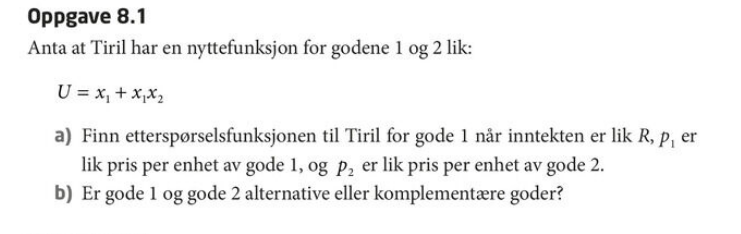
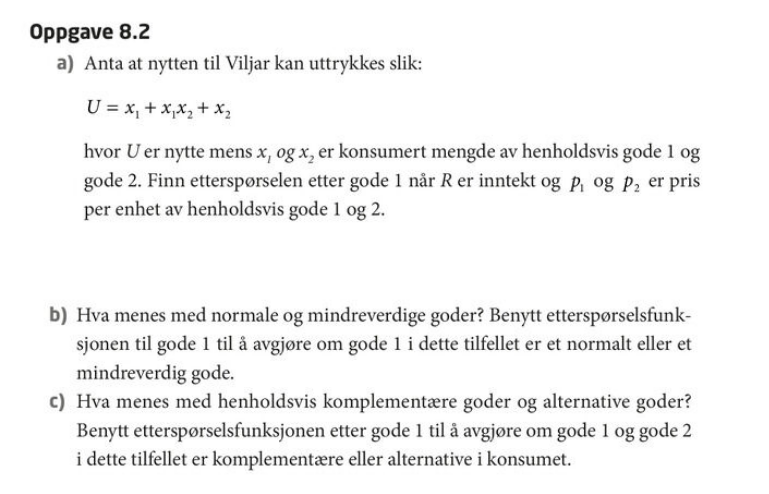
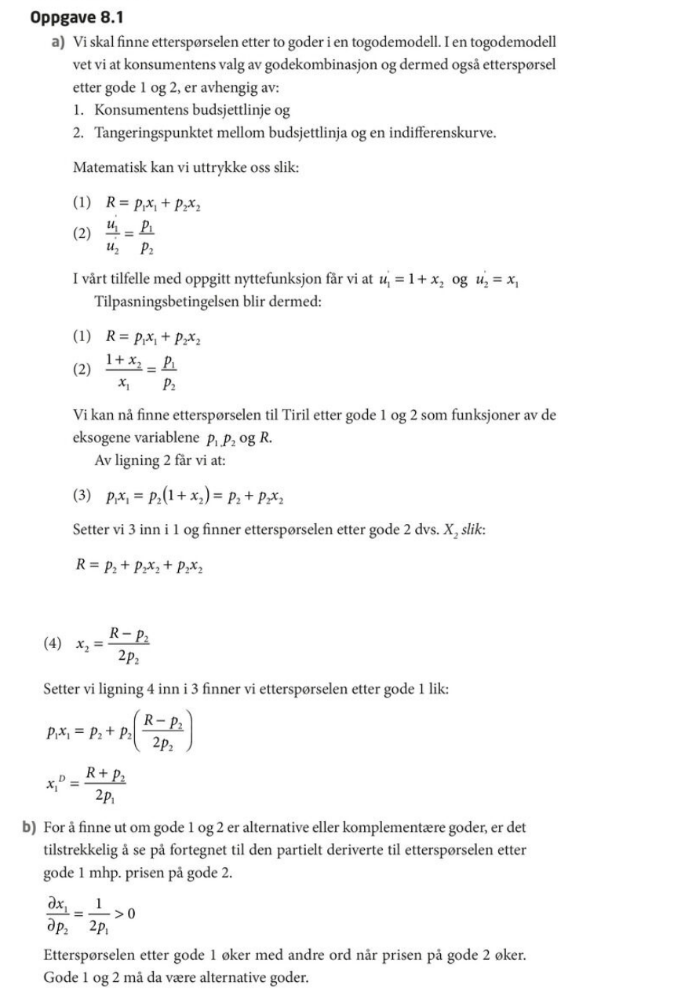
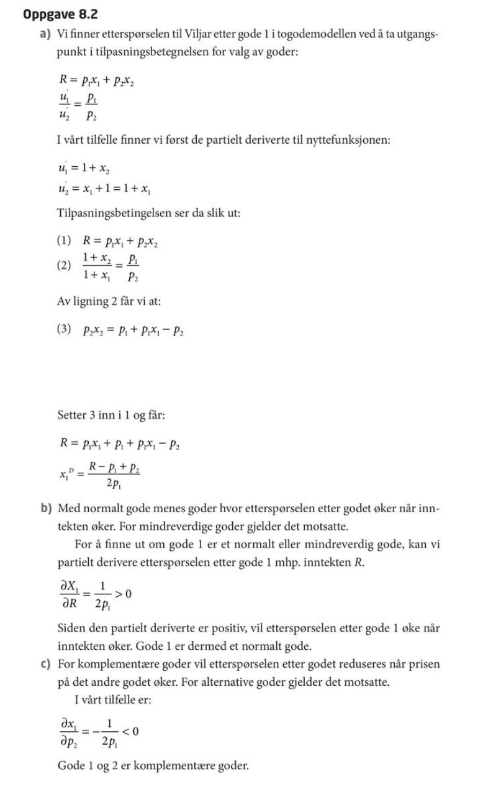
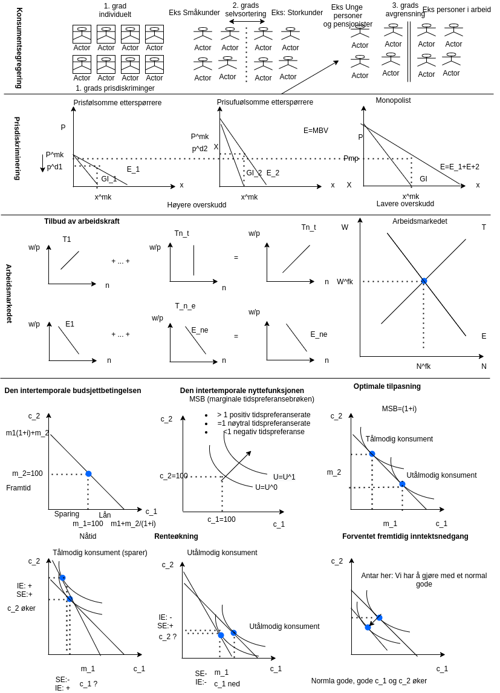

```{r, eval=FALSE}
rmarkdown::render('forelesning_10.Rmd')
```

# Forelesning 10:

## Oppgavesamlingen fra kapittel 8

Løsningforslag og løsningsstrategi

## Nye temaer i dag

-   Prisdiskriminering, 12
-   Markedet for arbeidskraft, 15.1
-   Konsumentens fordeling av konsum over tid, 18.2

Starer opp igjen kl. 13:15







Nærmere forklaring av utregningen

Vi kan ta utgangspunkt i løsningen fra Lagrange-problemet fra forelesning 6

$$
MSB=u'({x_{1}})/u'({x_{2}}) = p_{1}/p_{2}  \\
$$

$$
p_{1}x_{1}+p_{2}x_{2}=R
$$

Tilpasset oppgave 8.1 vil dette kunne skrives som $$
u'(x_{1})=1+x_{2} \\
u'(x_{2})=x_{1} \\
\text{slik at} \\
\frac{u'(x_{1})}{u'(x_{2})}=\frac{1+x_{2}}{x_{1}}=\frac{p_1}{p_2} \\
p_{1}x_{1}+p_{2}x_{2}=R
$$ Vi har to ligninger til å løse to ukjente. Dersom vi skal finne etterspørselfunksjonene, vil de to ukjente bestå av $x_{1}$ og $x_{2}$.

Strategi: Erstatt den første av de to endogene variablene med et uttrykk som består av kun eksogene variabler.

$$
p_{2}(1+x_2)=p_1x_1 \\
\text{ Satt inn i budsjettbetingelsen gir oss én ligning for å løse for en av de endogene variablene} \\
p_2(1+x_2)+p_{2}x_{2}=R \\
p_2+p_2x_2+p_{2}x_{2}=R \\
x_22p_2=R-p_2 \\
x_2=\frac{(R-p_2)}{2p_2}
$$

Strategi: Erstatt den andre av de to endogene variablene med et uttrykk som består av kun eksogene variabler.

$$
x_2=\frac{(R-p_2)}{2p_2} \\
p_2x_2=\frac{(R-p_2)}{2} \\
p_{1}x_{1}+p_{2}x_{2}=R \\
\text{ Satt inn i budsjettbetingelsen gir oss én ligning for å løse for en av de endogene variablene} \\
p_{1}x_{1}+\left(\frac{R-p_2}{2} \right)=R \\
p_{1}x_{1}+\left(\frac{R-p_2}{2} \right)=R \\
p_{1}x_{1}=R-\left(\frac{R-p_2}{2} \right) = \frac{2R-R+p_2}{2}\\
x_{1}=R-\left(\frac{R-p_2}{2} \right) = \frac{R+p_2}{2p_{1}}\\
$$

b)  

$$
x_{1}=\frac{R+p_2}{2p_{1}}\\ 
\frac{\partial x_1}{\partial R} = \frac{p_2}{2p_{1}} > 0 \\
\frac{\partial x_1}{\partial p_2} = \frac{1}{2p_{1}} > 0 \\
$$


Igjen kan vi ta utgangspunkt i løsningen fra Lagrange-problemet fra forelesning 6

$$
MSB=u'({x_{1}})/u'({x_{2}}) = p_{1}/p_{2}  \\
$$
$$
p_{1}x_{1}+p_{2}x_{2}=R
$$ 

Tilpasset oppgave 8.2 vil dette kunne skrives som 

$$
u'(x_{1})=1+x_{2} \\
u'(x_{2})=x_{1}+1 \\
\text{slik at} \\
\frac{u'(x_{1})}{u'(x_{2})}=\frac{1+x_{2}}{x_{1}+1}=\frac{p_1}{p_2} \\
p_{1}x_{1}+p_{2}x_{2}=R
$$ 

Vi har to ligninger til å løse to ukjente. Dersom vi skal finne etterspørselfunksjonene, vil de to ukjente bestå av $x_{1}$ og $x_{2}$.

Strategi: Erstatt den første av de to endogene variablene med et uttrykk som består av kun eksogene variabler.

$$
\frac{1+x_{2}}{x_{1}+1}=\frac{p_1}{p_2} \\
p_2(1+x_2)=p_1(x_1+1) \\
p_2+p_2x_2=p_1x_1+p_1 \\
p_2x_2=p_1x_1+p_1-p_2 \\
\text{ Satt inn i budsjettbetingelsen gir oss én ligning for å løse for en av de endogene variablene} \\
p_1x_1+(p_1x_1+p_1-p_2)=R \\
2p_1x_1=R-p_1+p_2 \\
x_1=\frac{R-p_1+p_2 }{2p_1}\\
\text{ Mens x_2 blir } \\
\frac{R-p_1+p_2 }{2}+p_{2}x_{2}=R \\
R-p_1+p_2+2p_{2}x_{2}=R \\
2p_{2}x_{2}=p_1-p_2 \\
x_{2}=\frac{(p_1-p_2)}{2p_2} 
$$





## DEL 4: MARKEDSTEORI: Prisdiskriminering

## Prisdiskriminering

I prinsippet er det mulig å tenke seg at det er mulig å forskjellig prise fra ulike konsumenter, istenfor samme pris fra elle konsumenter.

-   Vi har prisdiskriminering i et marked når en produsent har fordel (dvs. økt fortjeneste) av å ta ulik pris til forskjellige etterspørrere

Betingelsene for å kunne utføre prisdiskriminering

-   Ulike etterspørrere, eller gruppe av etterspørrer, må ha forskjellig marginal betalingsvilighet
-   Produsentene må kunne skille fra hverandre de ulike etterspørrerne, eller grupper av etterspørrer
-   Videresalg mellom gruppene fra konsument til konsumenter er ikke mulig, eller det er kostbard å utføre

---

## Første grads prisdiskriminering

Produsentene selger enhetene til ulike konsumenter til forskjellig pris. Prisen hver enkelt konsument betaler er identisk med det som konsumentent maksimalt er villig til å betale. Det innebærer at konsumentoverskuddet er lik null, mens produsenten sitter igjen med hele det samfunnsøkonomiske overskuddet.

---

## Andre grads prisdiskriminering

Konsumentene deler seg inn i ulike grupper basert på selvsortering. Produsenten tilbyr en meny av kontrakter til de ulike konsumentgruppene. Eks. en kontrakt til de som kjøper lite, og en annen kontrakt til de som kjøper mye.

---

## Tredje grads Prisdiskriminering

Produsent selger et gode til forskjellige priser ovenfor nærmest avgrensede konsumenter eller konsumentgrupper. Eks. kan en slik avgrensning foretas på ulike alderstrinn.

---

## DEL 5: ANDRE EMNER: Litt om arbeidsmarkedet

15.2 Et arbeidsmarked med fullkommen konkurranse

Etterspørelfunksjonen i arbeidsmarkedet utledes ved å summe de ulike bedrifters etterspøresl for ulike lønnsnivåer.

Tilbudsfunksjonen i arbeidsmarkedet utledes ved å summe de ulike husholdningers tilbud for ulike lønnsnivåer.

Lønnsdandelsen i likevekt skjer i skjæringsinspunktet mellom tilbuds- og etterspørselsfunksjonen, og mekansimen for å komme dette er analogt med det som er beskrevet under fullkommen konkurranse for produktmarkedet.

Endring i andre faktorer enn lønn som inngår disse kurvene, vil forårsake skift i kurvene.

---

## DEL 5: ANDRE EMNER: Tilpasninger over tid

### Konsumentens fordeling av konsum over tid

**Den intertemporale budjsettlinjen**

Starter med å la utgifter i de to periodene være gitt ved


$$
c_1=p_1x_1 \text { og } c_2=p_2x_2
$$

Videre lar vi de to prisene være uendret mellom de to perioden:

$$
p_1=p_2=1 \text{ og } p_1/p_2 = 1
$$

Inntektene i de to perioden er gitt ved hhv. $m_1$ og $m_2$

I første periode vil vi derfor ha at sparing (\$ s_1 \$) er gitt som

$$
s_1 = m_1 -c_1 \\
$$

Mens utgiftene i periode 2 er gitt ved

$$
c_2 = y_2 + s_1(1+i) \\
$$

Hvor $i$ utgjør rentenivået

---

Den intertemporale busjettbetingelsen kan enten skrives som (vurder fra periode 1) 

$$
c_1(1+i)+ c_2 = m_1(1+i)+ m_2  \\
$$ 
Eller som (vurdert fra periode 2) 
$$
c_1+ c_2/(1+i) = m_1+ m_2/(1+i)  
$$

Den intertemporale nyttefunksjone er gitt ved 

$$
U = u(c_1,c_2) \text{ hvor } u'(c_1) \text{ og } u'(c_2) >0
$$

---

Optimering av konsumet over tid kan derfor formuleres som følgende optimeringsproblem 

\begin{equation}
\text{ Maks } U = u(c_1,c_2) \text{ gitt at } c_1(1+i)+ c_2 = m_1(1+i)+ m_2 
\end{equation}


Hvor løsningen er gitt ved:


\begin{equation}
MSB = \frac{u'(c_1)}{u'(c_2)} = (1+1) \\
c_1(1+i)+ c_2 = m_1(1+i)+ m_2 
\end{equation}



