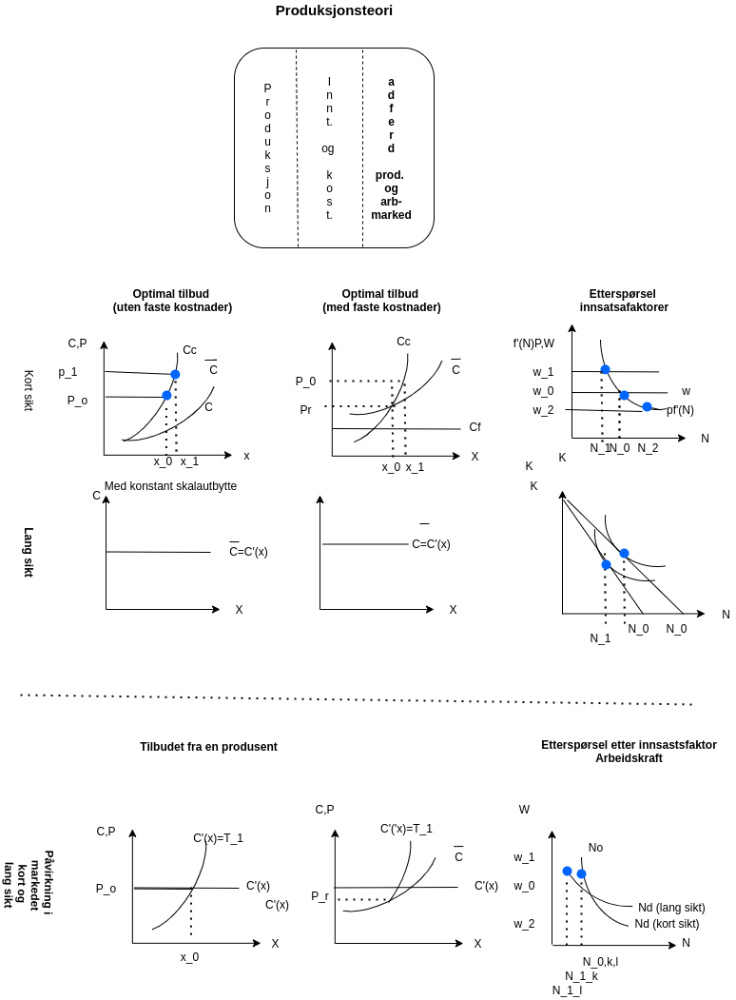

# Forelesning 4

## DEL 2: PRODUKSJONSTEORI: Produsentens tilpasning II: Fortjenestemaksimering og tilbud

### Fortjenestemaksimering som mål for edriften

### Hvor stor skal produksjonen være?

produksjonen

$x=f(N,K)$

totale kostnader

$C=wN+rK$

Inntekt

$R=px$

Fortjeneste (F): Inntekter (R) - Kostnader (C)

$F=R-C$

#### Kort sikt

$\text{Maks } F = R-C = px-C(x)$

Førsteordensbetingelse

mhp $x$

$$
F'{x} = p -c'(x) = 0 \\
p = c'(x)
$$

Andreordens betingelse

$$
F''(X) = -c''(x)< 0
$$

Tilpasser produksjonen der hvor pris er lik grensekostnad

$$
F = px -c(x) \\
px/x - c(x)/x > 0 \\
p - \overline{c} > 0 \\
p > \overline{c} >  \text{krav for at bedriften skal være villig til å produsere} 
$$

#### Lang sikt

Avtagende skalautbytte

$\text{Maks } F = R-C = px-wN -rK$

#### Kort sikt

#### Lang sikt (konstant skalautbytte)

### Hvor stor skal faktorbruken være?

### Hvor stor skal faktorbruken være?

#### Kort sikt (arbeidskraft)

$\text{Maks } F = R-C = px-wN=pf(N,K_{0}) - wN$

mhp N

Førsten ordens betingelsen

$$
F'(N) = pf'(N) - w = 0 \\
pf'(N^{*}) = w 
$$

Optimal bruk av arbeidskrafit finner vi der hvor verdien av grenseproduktiviteten til den sist arbeideren (venstre side av likhetstegnet) er lik lønnskostnaden (høyre side av likhetstegnet)

#### Lang sikt (konstant skalautbytte)

Kostnadsminimering for et gitt produksjonsnivå (sistnevnte bestemt av etterspørselen)

#### Kort sikt

#### Lang sikt (konstant skalautbytte)

### Bedriftens oppførsel i markedet

#### Produktmarkedet

#### Faktormarkedet

### Fortjenestemaksimering som mål for bedriften

### Bedriftens oppførsel i markedet

#### Produktmarkedet

#### Faktormarkedet

