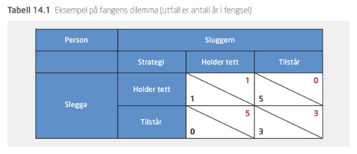
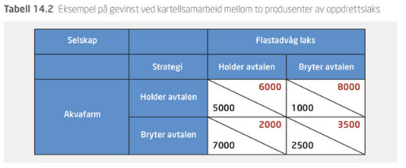
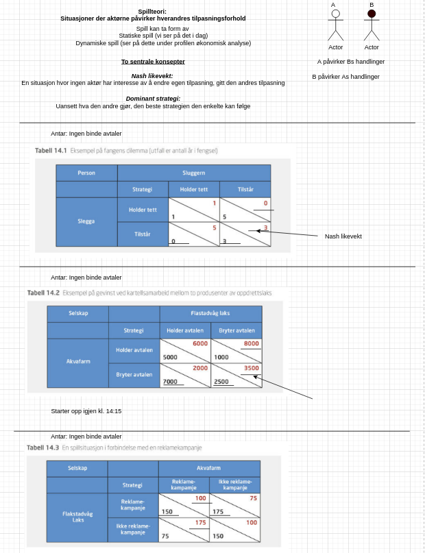

```{r xaringan-tile-view, echo=FALSE, message=F, warning=F}
xaringanExtra::use_editable(expires = 1)
xaringanExtra::use_tile_view()
#xaringanExtra::use_share_again()
xaringanExtra::use_scribble()
xaringanExtra::use_webcam()
#xaringanExtra::use_slide_tone()
xaringanExtra::use_panelset()
library(htmlTable)
library(magrittr)
library(xaringan)
library(plotly)
library(emo)
```

```{r eval=FALSE, include=FALSE}
tes <- "dagens.Rmd"
xaringan::inf_mr(tes)
rmarkdown::render(tes)
```

```{r echo=FALSE, message=FALSE, warning=FALSE}
source("timeplan.R")
```

class: inverse, center, middle

# Kapittel 14

#`r paste(substring(del[11],3,15),'',substring(tema[12],1,15))`

`r paste("Oppdatert:",Sys.Date())`

---

## Spillteori

Situasjoner der aktørene påvirker hverandres tilpasningsforhold.

**To sentrale konsepter**

- *Nash-likevekter*
> En situasjon hvor ingen aktør har interesse av å endre egen tilpasning, gitt den andres tilpasning 
- *Dominante strategier*
> Dersom aktøren kommer best ut ved å velge denne strategien uavhengig av hva den andre aktøren gjør. 

---

# Eksempel 1: Fangens dilemma


```{r, echo=FALSE, out.width="100%", fig.cap=""}

```

- Aktørene ønsker seg lavest mulig fengselsstraff.

---

# Eksempel 2: Kartellsammarbeid

```{r, echo=FALSE, out.width="100%", fig.cap=""}

```

- Aktørene ønsker seg høyest mulig overskudd.

---

# Eksempel 3: Reklamekampanje

```{r, echo=FALSE, out.width="100%", fig.cap=""}
knitr::include_graphics("drawio/tabell_14.3.png")
```

- Aktørene ønsker seg høyest mulig overskudd.

---

## Appendiks (diagramark benyttet under forelesning)

```{r, echo=FALSE, out.width="45%", fig.cap=""}

```

```{r, eval=T, echo=F}
# Git relaterte
knitr::knit_exit()
```

```{r, echo=FALSE, out.width="45%", fig.cap=""}
system('drawio drawio/spillteori.drawio')
```

