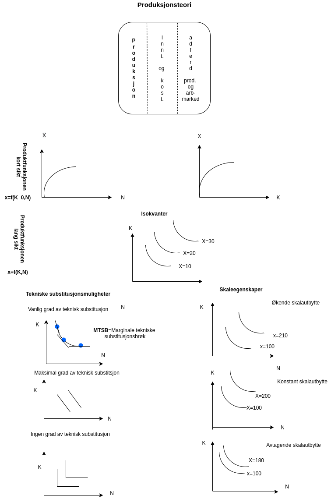

# Forelesning 2

## DEL 2: PRODUKSJONSTEORI: PRODUSENTENS ØKONOMISKE ATFERD

### Innledning

Forenkler produksjonsbildet

-   Bedriftens innsastsfaktorer består kun av arbeidskraft (N) og Kapital (K)

-   Kort sikt: Kun arbeidskraft variabel innsatsafaktor

-   Lang sikt: Kan vi variere både arbeidskraft og kapital

### Produksjons og teknologiske forhold på kort sikt

***Produktfunksjonen***

$$
X = f(K_{0},N) = f(N)
$$

+------------------+-------------+----------------+--------------------------------------------------------------------------+----------------------------------------------------------------------------------------------------------------------------------------------------+
| N (arbeidskraft) | K (kapital) | X (produksjon) | Grenseproduktiviteten                                                    | Gjennomsnittsproduktiviteten                                                                                                                       |
+==================+=============+================+==========================================================================+====================================================================================================================================================+
| 1                | 20          | 10             | \-                                                                       |                                                                                                                                                    |
+------------------+-------------+----------------+--------------------------------------------------------------------------+----------------------------------------------------------------------------------------------------------------------------------------------------+
| 2                | 20          | 24             | 24-10=14                                                                 | 24/2                                                                                                                                               |
+------------------+-------------+----------------+--------------------------------------------------------------------------+----------------------------------------------------------------------------------------------------------------------------------------------------+
| 3                | 20          | 39             |                                                                          |                                                                                                                                                    |
+------------------+-------------+----------------+--------------------------------------------------------------------------+----------------------------------------------------------------------------------------------------------------------------------------------------+
| **4**            | **20**      | **52**         | ------------------------------------------------------------------------ |                                                                                                                                                    |
+------------------+-------------+----------------+--------------------------------------------------------------------------+----------------------------------------------------------------------------------------------------------------------------------------------------+
| **5**            | **20**      | **61**         | ------------------------------------------------------------------------ |                                                                                                                                                    |
+------------------+-------------+----------------+--------------------------------------------------------------------------+----------------------------------------------------------------------------------------------------------------------------------------------------+
| **6**            | **20**      | **66**         | ------------------------------------------------------------------------ |                                                                                                                                                    |
+------------------+-------------+----------------+--------------------------------------------------------------------------+----------------------------------------------------------------------------------------------------------------------------------------------------+
| **7**            | **20**      | **66**         | ------------------------------------------------------------------------ |                                                                                                                                                    |
+------------------+-------------+----------------+--------------------------------------------------------------------------+----------------------------------------------------------------------------------------------------------------------------------------------------+
| 8                | 20          | 64             |                                                                          |                                                                                                                                                    |
+------------------+-------------+----------------+--------------------------------------------------------------------------+----------------------------------------------------------------------------------------------------------------------------------------------------+
| 9                | 20          | 56             |                                                                          |                                                                                                                                                    |
+------------------+-------------+----------------+--------------------------------------------------------------------------+----------------------------------------------------------------------------------------------------------------------------------------------------+
| 10               | 20          | 44             |                                                                          |                                                                                                                                                    |
+------------------+-------------+----------------+--------------------------------------------------------------------------+----------------------------------------------------------------------------------------------------------------------------------------------------+

$$
x = f'(N) > 0 \\ 
x = f''(N) < 0
$$

### Produksjons og teknologiske forhold på lang sikt

#### *Isokvanter og MTSB*

#### *Substitusjonsegenskaper*

#### *Skalaegenskaper*



**Øvelse til neste gang:**

1.  Finn formelt den margianale tekniske substitusjonsbrøk ved å differeniere produktfunksjonen som gjeler på lang sikt for et gitt produksjonsnivå. *Løsning:* $\overline{x} = f(K,N)$ Dersom vi totaldifferensierer dette uttrykket får vi $$
    \Delta \overline{x} = f'_{K}(K,N)\Delta K + f'_{N}(K,N)\Delta N = 0 
    $$ Uttrykket ovenfor kan skrives som $$
    f'_{K}(K,N)\Delta K =- f'_{N}(K,N)\Delta N \\
    \frac{\Delta K}{\Delta N} = - \frac{f'_{N}(K,N)}{f'_{K}(K,N)} \\
    MTSB \equiv -\frac{\Delta K}{\Delta N} =  \frac{f'_{N}(K,N)}{f'_{K}(K,N)}>0
    $$

2.  Studer eksempel 4.2 fra pensumbok

3.  Anta at produktfunksjonen er gitt ved: $x = N^{0,7}+K^{0,3}$ Regn ut MTSB for denne produktfunksjonen.

Grenseproduktiviteten til arbeidskraften er gitt ved $$
\frac{\partial x}{\partial N} = 0,7N^{0,7-1} =  0,7N^{-0,3} 
$$

Grenseproduktiviteten til kapitalen er gitt ved $$
\frac{\partial x}{\partial K} = 0,3K^{0,3-1} =  0,3K^{-0,7} 
$$

MTSB blir derfor $$
MTSB \equiv \frac{\Delta K}{\Delta N} = \frac{\frac{\partial x}{\partial N}}{\frac{\partial x}{\partial K}} = \frac{0,7N^{-0,3}}{0,3K^{-0,7}} 
$$ \$\$

```{r}

```

+------------------+-------------+----------------+-----------------------+------------------------------+
| N (arbeidskraft) | K (kapital) | X (produksjon) | Grenseproduktiviteten | Gjennomsnittsproduktiviteten |
+==================+=============+================+=======================+==============================+
| 1                | 20          | 10             | \-                    |                              |
+------------------+-------------+----------------+-----------------------+------------------------------+
| 2                | 20          | 24             | 14                    |                              |
+------------------+-------------+----------------+-----------------------+------------------------------+
| 3                | 20          | 39             | 15                    | 39/3                         |
+------------------+-------------+----------------+-----------------------+------------------------------+
| **4**            | **20**      | **52**         | **1**78               | 52/4=13                      |
+------------------+-------------+----------------+-----------------------+------------------------------+
| **5**            | **20**      | **61**         | **9**                 | 61/4=15                      |
+------------------+-------------+----------------+-----------------------+------------------------------+
| **6**            | **20**      | **66**         | **5**                 | 66/4=16.5                    |
+------------------+-------------+----------------+-----------------------+------------------------------+
| **7**            | **20**      | **66**         | **0**                 | 66/4=16.5                    |
+------------------+-------------+----------------+-----------------------+------------------------------+
| 8                | 20          | 64             | -2                    |                              |
+------------------+-------------+----------------+-----------------------+------------------------------+
| 9                | 20          | 56             | -8                    |                              |
+------------------+-------------+----------------+-----------------------+------------------------------+
| 10               | 20          | 44             | -12                   |                              |
+------------------+-------------+----------------+-----------------------+------------------------------+
