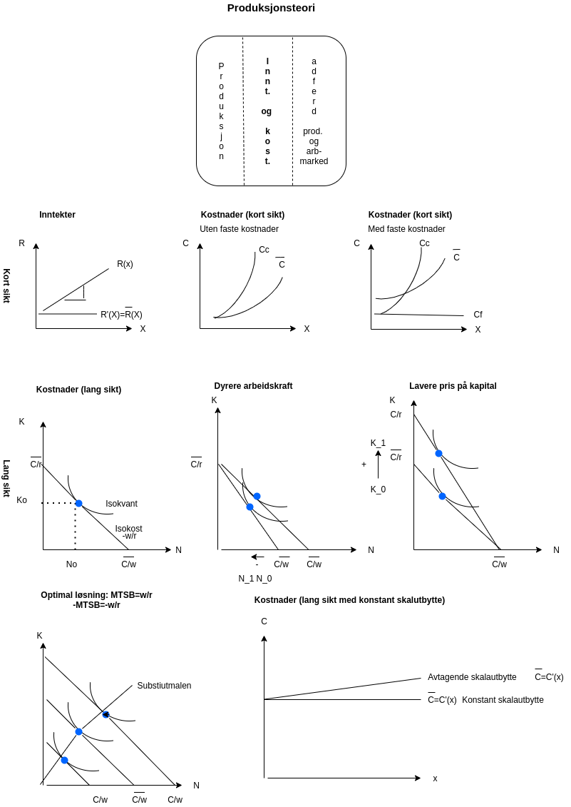

# Forelesning 3

### Inntekter på kort og lang sikt

+----------------+----------------+--------------+---------------+----------------------+
| Solgte enheter | Pris per enhet | Salgsinntekt | Grenseinntekt | Gjennomsnittsinntekt |
+================+================+==============+===============+======================+
| 1              | 1000,-         | 1000,-       |               |                      |
+----------------+----------------+--------------+---------------+----------------------+
| 2              | 1000,-         | 2000,-       | 4             |                      |
+----------------+----------------+--------------+---------------+----------------------+
| 3              | 1000,-         | 3000,-       |               |                      |
+----------------+----------------+--------------+---------------+----------------------+

$\text{Pris:} p$

$\text{Mengde: } x$

$\text{Inntekt: } R(x)=px$

$\text{Grenseinntekt: } R'(x)$

### Kostnader på kort sikt

| *eks* a) Marignalproduktivitet synkede (mest relevant for dette kurset) |
|-------------------------------------------------------------------------|

+------------------------+--------+-----------------+--------------------+-----------------+-------------------------------------+-------------------+------------------------+
| Antall produserte (PC) | Lønn   | Antall arbeider | Variable kostnader | Faste kostnader | Totale kostnader (variable + faste) | Grensekostnaden   | Gjennomsnittskostnaden |
+========================+========+=================+====================+=================+=====================================+===================+========================+
| 9                      | 1000,- | 9               | 9000               | 0,-             | 9000+0=9000                         |                   | 9000/9=1000,-          |
+------------------------+--------+-----------------+--------------------+-----------------+-------------------------------------+-------------------+------------------------+
| 10                     | 1000,- | 10              | 10000              | 0-              | 1000+0=10000                        | 10000-9000=1000   | 10000/10=1000,-        |
+------------------------+--------+-----------------+--------------------+-----------------+-------------------------------------+-------------------+------------------------+
| 11                     | 1000,- | 11.1            | 11100              | 0,-             | 11100+0=11100                       | 11100-10000=10100 | 10900/11=1009,-        |
+------------------------+--------+-----------------+--------------------+-----------------+-------------------------------------+-------------------+------------------------+

*eks* b) Marginalproduktivitet opp (mindre relevant)

+------------------------------+--------+---------+---------------------------+-----------------+-------------------------------------+-----------------+------------------------+
| Antall produserte enher (PC) | Lønn   | Antall  | Variable kostnader (lønn) | Faste kostnader | Totale kostnader (variable + faste) | Grensekostnaden | Gjennomsnittskostnaden |
|                              |        |         |                           |                 |                                     |                 |                        |
|                              |        | ansatte |                           |                 |                                     |                 |                        |
+==============================+========+=========+===========================+=================+=====================================+=================+========================+
| 9                            | 1000,- | 9       | 9000,-                    | 0               | 9000+0=9000                         |                 | 9000/9=100             |
+------------------------------+--------+---------+---------------------------+-----------------+-------------------------------------+-----------------+------------------------+
| 10                           | 1000,- | 10      | 10000,-                   | 0               | 10000+0=10000                       | 10000-9000=1000 | 10000/10=100           |
+------------------------------+--------+---------+---------------------------+-----------------+-------------------------------------+-----------------+------------------------+
| 11                           | 1000,- | 10.9    | 11000,-                   | 0               | 10900+0=10900                       | 10900-10000=900 | 10000/10=100=991       |
+------------------------------+--------+---------+---------------------------+-----------------+-------------------------------------+-----------------+------------------------+

$\text{Faste kostnader: } C_{F}$

$\text{Variable kostnader: } C_{V}=C_{V}(x)$

$\text{Totale kostnader: } C = C_{F}+C_{V} = C_{F}+C_{V}(x)= C(x)$

$\text{Grensekostnad: } GK = \frac{dC(x)}{dx}=C'(x)$

$\text{Gjennomsnittkostnad:} = \overline{C} =\frac{C}{x}=\frac{C_{F}+C_{V}}{x}=\underset{\equiv \overline{C}_{F}}{\frac{C_{F}}{x}} + \underset{\equiv \overline{C}_{V}}{\frac{C_{V}}{x}}=\overline{C}_{F}+\overline{C}_{V}$

**Øvelse**: legg inn faste kostnader tilsvarende et beløp 2000,- i tabellen ovenfor og vis utregningen av de totale kostnaden, grensekostnadene og gjennomsnittskostnadene.

*Løsning*:

Antall produserte (PC)

+-------+--------+-----------------+--------------------+-----------------+-------------------------------------+--------------------+------------------------+
|       | Lønn   | Antall arbeider | Variable kostnader | Faste kostnader | Totale kostnader (variable + faste) | Grensekostnaden    | Gjennomsnittskostnaden |
+=======+========+=================+====================+=================+=====================================+====================+========================+
| 9     | 1000,- | 9               | 9000,-             | 2000,-          | 9000+200=11000,-                    |                    | 11000/9=100=12222.22,- |
+-------+--------+-----------------+--------------------+-----------------+-------------------------------------+--------------------+------------------------+
| 10    | 1000,- | 10              | 10000,-            | 2000-           | 10000+200=12000,-                   | 12000-11000=1000,- | 12000/10=1200          |
+-------+--------+-----------------+--------------------+-----------------+-------------------------------------+--------------------+------------------------+
| 11    | 1000,- | 11.1            | 11100,-            | 2000,-          | 11100+200                           | 12000-13100=1100   | 13100/11=1190.9,-      |
|       |        |                 |                    |                 |                                     |                    |                        |
|       |        |                 |                    |                 | =13100,-                            |                    |                        |
+-------+--------+-----------------+--------------------+-----------------+-------------------------------------+--------------------+------------------------+

### Kostnader på kort og lang sikt:

Anta at alle kostnadene er variable. Vi ser da bort i fra faste kostnader

Totale kostnader (C) er da gitt ved:

$$
C = wN  +  rK
$$

\$100\*10+2000\*10=1000+20000=21000

Isokost

$$
\overline{C}= wN + rK
$$

Helingen på isokostline

$$
\Delta \overline{C}= w\Delta N + r\Delta K = 0 \\
 r\Delta K = -w\Delta N  \\
\frac{\Delta K}{\Delta N} = - \frac{w}{r} 
$$

Bruker hele budsjettet på arbeidskraft $\Rightarrow$ $K=0$

$$
\overline{C}= wN + r0 = wN \\
\overline{C}/w = N \\
N = \overline{C}/w 
$$

Øvelse: Bruke hele budsjettet (kostnaden) på kapital $\Rightarrow$ $N=0$

Løs isokostfunksjonen for kapital

$$
\overline{C}= w0 + rK = wN \\
\overline{C}/r = K \\
K = \overline{C}/r 
$$

### Optimal tilpasning for bruk av ressurser

#### Minimering av kostnaden for en gitt produksjon

Min $C=wN +rK$ gitt (beskrankning) $x_{0}=f(K,N)$

Lagrange metode:

$$
L = wN+rK - \lambda(f(K,N)-x_{0})
$$

Første ordens betingelsen er gitt ved

$$
\partial L/\partial N = w - \lambda  f'_{N}=0 \\ 
\partial L/\partial K = r - \lambda f'_{K}=0 \\
$$

$$
x_{0}= f(K,N) 
$$

Kombinerer de to første ordens betingelsene gir oss løsningen

$$
w/r=\frac{\lambda f'_{N}}{ f'_{K}} = \frac{f'_{N}}{f'_{K}} = MTSB
$$

Gitt at $x_{0}= f(K,N)$

Optimal løsning er karakterisert ved tangeringspunktet mellom isokvant og isokostlinjen.

#### Maksimering av produksjonen for en gitt kostnad

Øvelse:

Max $x=f(K,N)$ gitt $\overline{C}=wN +rK$ gitt (beskrankning)

Lagrange metode:

$$
L = f(K,N) - \lambda(wN+rK \overline-{C})
$$

Første ordens betingelsen er gitt ved

$$
\partial L/\partial N = f'_{N} - \lambda w  =0 \\ 
\partial L/\partial K = f'_{K} - \lambda r =0 \\
$$

$$
x_{0}= f(K,N) 
$$

Kombinerer de to første ordens betingelsene gir oss løsningen

$$
\lambda w/\lambda r=w/r = \frac{f'_{N}}{f'_{K}} = MTSB
$$

Gitt at $x_{0}= f(K,N)$

Optimal løsning er også her karakterisert ved tangeringspunktet mellom isokvant og isokostlinjen.

#### 

# Forelesning 3

### Inntekter på kort og lang sikt

+----------------+----------------+--------------+------------------+----------------------+
| Solgte enheter | Pris per enhet | Salgsinntekt | Grenseinntekt    | Gjennomsnittsinntekt |
+================+================+==============+==================+======================+
| 1              | 1000,-         | 1000,-       |                  | 1000/1=1000          |
+----------------+----------------+--------------+------------------+----------------------+
| 2              | 1000,-         | 2000,-       | (2000-1000)=1000 | 2000/2=1000          |
+----------------+----------------+--------------+------------------+----------------------+
| 3              | 1000,-         | 3000,-       | (3000-2000)=1000 | 3000/3=1000          |
+----------------+----------------+--------------+------------------+----------------------+

$\text{Pris:} p$

$\text{Mengde: } x$

$\text{Inntekt: } R(x)=px$

$\text{Grenseinntekt: } R'(x)$

### Kostnader på kort sikt

| *eks* a) Marignalproduktivitet ned (mest relevant for dette kurset) |
|---------------------------------------------------------------------|

+------------------------+--------+-----------------+--------------------+-----------------+-------------------------------------+------------------+------------------------+
| Antall produserte (PC) | Lønn   | Antall arbeider | Variable kostnader | Faste kostnader | Totale kostnader (variable + faste) | Grensekostnaden  | Gjennomsnittskostnaden |
+========================+========+=================+====================+=================+=====================================+==================+========================+
| 9                      | 1000,- | 9               | 9000               | 0,-             | 9000+0=9000                         |                  | 9000/9=100,-           |
+------------------------+--------+-----------------+--------------------+-----------------+-------------------------------------+------------------+------------------------+
| 10                     | 1000,- | 10              | 10000              | 0-              | 1000+0=10000                        | 10000-9000=1000  | 10000/10=1000,-        |
+------------------------+--------+-----------------+--------------------+-----------------+-------------------------------------+------------------+------------------------+
| 11                     | 1000,- | 11.1            | 11100              | 0,-             | 11100+0=11100                       | 11100-10000=1100 | 10900/11=1009,-        |
+------------------------+--------+-----------------+--------------------+-----------------+-------------------------------------+------------------+------------------------+

*eks* b) Marginalproduktivitet opp (mindre relevant)

+------------------------------+--------+---------+---------------------------+-----------------+-------------------------------------+-----------------+------------------------+
| Antall produserte enher (PC) | Lønn   | Antall  | Variable kostnader (lønn) | Faste kostnader | Totale kostnader (variable + faste) | Grensekostnaden | Gjennomsnittskostnaden |
|                              |        |         |                           |                 |                                     |                 |                        |
|                              |        | ansatte |                           |                 |                                     |                 |                        |
+==============================+========+=========+===========================+=================+=====================================+=================+========================+
| 9                            | 1000,- | 9       | 9000,-                    | 0               | 9000+0=9000                         |                 | 9000/9=100             |
+------------------------------+--------+---------+---------------------------+-----------------+-------------------------------------+-----------------+------------------------+
| 10                           | 1000,- | 10      | 10000,-                   | 0               | 10000+0=10000                       | 10000-9000=1000 | 10000/10=100           |
+------------------------------+--------+---------+---------------------------+-----------------+-------------------------------------+-----------------+------------------------+
| 11                           | 1000,- | 10.9    | 11000,-                   | 0               | 10900+0=10900                       | 10900-10000=900 | 10000/10=100=991       |
+------------------------------+--------+---------+---------------------------+-----------------+-------------------------------------+-----------------+------------------------+

$\text{Faste kostnader: } C_{F}$

$\text{Variable kostnader: } C_{V}=C_{V}(x)$

$\text{Totale kostnader: } C = C_{F}+C_{V} = C_{F}+C_{V}(x)= C(x)$

$\text{Grensekostnad: } GK = \frac{dC(x)}{dx}=C'(x)$

$\text{Gjennomsnittkostnad:} = \overline{C} =\frac{C}{x}=\frac{C_{F}+C_{V}}{x}=\underset{\equiv \overline{C}_{F}}{\frac{C_{F}}{x}} + \underset{\equiv \overline{C}_{V}}{\frac{C_{V}}{x}}=\overline{C}_{F}+\overline{C}_{V}$

**Øvelse**: legg inn faste kostnader tilsvarende et beløp 2000,- i tabellen ovenfor og vis utregningen av de totale kostnaden, grensekostnadene og gjennomsnittskostnadene.

*Løsning*:

Antall produserte (PC)

+-------+--------+-----------------+--------------------+-----------------+-------------------------------------+--------------------+------------------------+
|       | Lønn   | Antall arbeider | Variable kostnader | Faste kostnader | Totale kostnader (variable + faste) | Grensekostnaden    | Gjennomsnittskostnaden |
+=======+========+=================+====================+=================+=====================================+====================+========================+
| 9     | 1000,- | 9               | 9000,-             | 2000,-          | 9000+200=11000,-                    |                    | 11000/9=100=12222.22,- |
+-------+--------+-----------------+--------------------+-----------------+-------------------------------------+--------------------+------------------------+
| 10    | 1000,- | 10              | 10000,-            | 2000-           | 10000+200=12000,-                   | 12000-11000=1000,- | 12000/10=1200          |
+-------+--------+-----------------+--------------------+-----------------+-------------------------------------+--------------------+------------------------+
| 11    | 1000,- | 11.1            | 11100,-            | 2000,-          | 11100+200                           | 12000-13100=1100   | 13100/11=1190.9,-      |
|       |        |                 |                    |                 |                                     |                    |                        |
|       |        |                 |                    |                 | =13100,-                            |                    |                        |
+-------+--------+-----------------+--------------------+-----------------+-------------------------------------+--------------------+------------------------+

### Kostnader på kort og lang sikt:

Anta at alle kostnadene er variable. Vi ser da bort i fra faste kostnader

Totale kostnader (C) er da gitt ved:

$$
C = wN  +  rK
$$

\$100\*10+2000\*10=1000+20000=21000

Isokost

$$
\overline{C}= wN + rK
$$

Helingen på isokostline

$$
\Delta \overline{C}= w\Delta N + r\Delta K = 0 \\
 r\Delta K = -w\Delta N  \\
\frac{\Delta K}{\Delta N} = - \frac{w}{r} 
$$

Bruker hele budsjettet på arbeidskraft -> $K=0$

$$
\overline{C}= wN + r0 = wN \\
\overline{C}/w = N \\
N = \overline{C}/w 
$$

Øvelse: Bruke hele budsjettet (kostnaden) på kapital -> $N=0$

Løs isokostfunksjonen for kapital

$$
\overline{C}= w0 + rK = wN \\
\overline{C}/r = K \\
K = \overline{C}/r 
$$

### Optimal tilpasning for bruk av ressurser

#### Minimering av kostnaden for en gitt produksjon

Min $C=wN +rK$ gitt (beskrankning) $x_{0}=f(K,N)$

Lagrange metode:

$$
L = wN+rK - \lambda(f(K,N)-x_{0})
$$

Første ordens betingelsen er gitt ved

$$
\partial L/\partial N = w - \lambda  f'_{N}=0 \\ 
\partial L/\partial K = r - \lambda f'_{K}=0 \\
$$

$$
x_{0}= f(K,N) 
$$

Kombinerer de to første ordens betingelsene gir oss løsningen

$$
w/r=\frac{\lambda f'_{N}}{ f'_{K}} = \frac{f'_{N}}{f'_{K}} = MTSB
$$

Gitt at $x_{0}= f(K,N)$

Optimal løsning er karakterisert ved tangeringspunktet mellom isokvant og isokostlinjen.

#### Maksimering av produksjonen for en gitt kostnad

Øvelse:

Max $x=f(K,N)$ gitt $\overline{C}=wN +rK$ gitt (beskrankning)

Lagrange metode:

$$
L = f(K,N) - \lambda(wN+rK \overline-{C})
$$

Første ordens betingelsen er gitt ved

$$
\partial L/\partial N = f'_{N} - \lambda w  =0 \\ 
\partial L/\partial K = f'_{K} - \lambda r =0 \\
$$

$$
x_{0}= f(K,N) 
$$

Kombinerer de to første ordens betingelsene gir oss løsningen

$$
\lambda w/\lambda r=w/r = \frac{f'_{N}}{f'_{K}} = MTSB
$$

Gitt at $x_{0}= f(K,N)$

Optimal løsning er også her karakterisert ved tangeringspunktet mellom isokvant og isokostlinjen.

#### 

