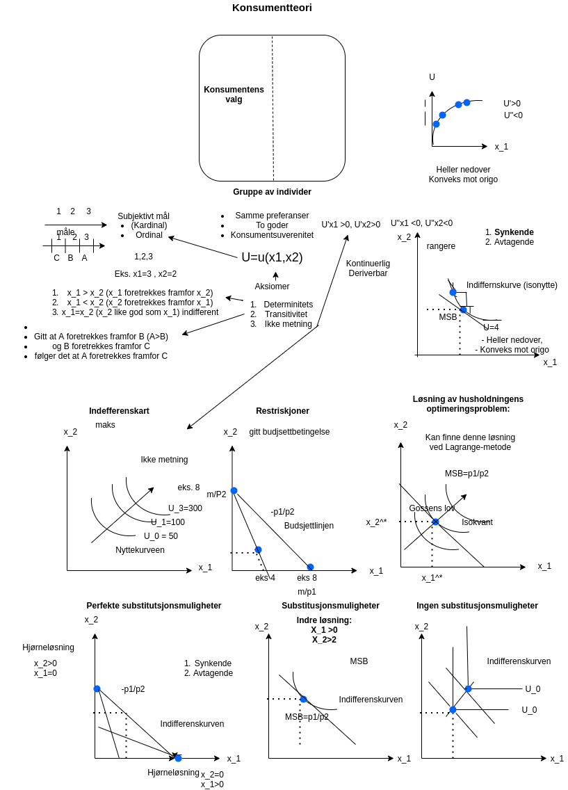

# Forelesning 5

## DEL 3: KONSUMENTTEORI: Konsumentents valg

### Preferansestruktur

### Budsjettbetingelse

### Valg av goder

### En Øvelse

### Preferansestruktur

$$
$$

$$
U=u(x_{1}, x_{2}) \\ 
\text{Gitt nyttenivå} \\
\overline{U}=u(x_{1},x_{2}) \\ 
d\overline{U}=d(u(x_{1},x_{2})) \\
0 = u'(x_{1})\Delta x_{1}+u'(x_{2})\Delta x_{2} \\
-u'(x_{2})\Delta x_{2} = u'(x_{1})\Delta x_{1} \\ 
-\Delta x_{2}/\Delta x_{1}  = u'(x_{1})/u'(x_{2})\\
MSB\equiv -\Delta x_{2}/\Delta x_{1}  = u'(x_{1})/u'(x_{2})\\ 
$$

### Budsjettbetingelse

$$
p_{1}x_{1}+p_{2}x_{2}=m
$$

Helningen på kurven er gitt ved

$$
d(p_{1}x_{1}+p_{2}x_{2})=d(m)=0 \\
p_{1}\Delta x_{1}+p_{2}\Delta x_{2}  = 0 \\ 
p_{2}\Delta x_{2} =-p_{1}\Delta x_{1} \\
\Delta x_{2}/\Delta x_{1} = -p_{1}/p_{2}  \\ 
$$

Dersom vi kun velger x1 -\> x2=0

$$
p_{1}x_{1}=m \\
x_{1} =m/p_{1}
$$

Øvelse: Hva skjer dersom vi kun velger x2

### Valg av goder

Maks

$$
U=u(x_{1}, x_{2}) \\ 
$$

Gitt at

$$
p_{1}x_{1}+p_{2}x_{2}=m
$$

$$
L = u(x_{1},x_{2}) - \lambda(p_{1}x_{1}+p_{2}x_{2}-m)
$$

Første ordens betingelsene

$$
L'_{x1}=u'({x_{1}}) - \lambda p_{1} = 0 \\
L'_{x2}=u'({x_{2}}) - \lambda p_{2} = 0 \\
p_{1}x_{1}+p_{2}x_{2}=m
$$

Som gir oss (indre løsning) følgende førsteordensbetingelser

$$
MSB=u'({x_{1}})/u'({x_{2}}) = p_{1}/p_{2}  \\
$$
$$
p_{1}x_{1}+p_{2}x_{2}=m
$$

### 

Som kan omskrives som (Gossens lov)

$$
u'({x_{1}})/p_{1} = u'({x_{2}})/p_{2}  \\
$$

### Øvelser

Starter opp igjen 14:15

**Oppgave 1**

Anta at du har en inntekt på 40 NOK som brukes på to goder. Gode 1 koster 10per enhet, og gode 2 koster 5 per enhet.

(a) Skriv ned budsjettbetingelsen.

    $$
    10x_{1}+5x_{2}=40
    $$

(b) Hvor mye kan du kjøpe dersom du bruker all inntekten på gode 1?

    $$
    x_{1} = 40/10 = 4
    $$

(c) Hvor mye kan du kjøpe dersom du bruker all inntekten på gode 2?

    $$
    x_{2} = 40/5 = 8
    $$

(d) Tegn budsjettlinja.

    Se diagramark

(e) Anta at prisen på gode 1 faller til 5 NOK. Skriv ned ny budsjettbetingelse. Tegn inn denne i diagrammet du brukte i forrige spørsmål

    $$
    5x_{1}+5x_{2}=40
    $$

    {width="2562"}
