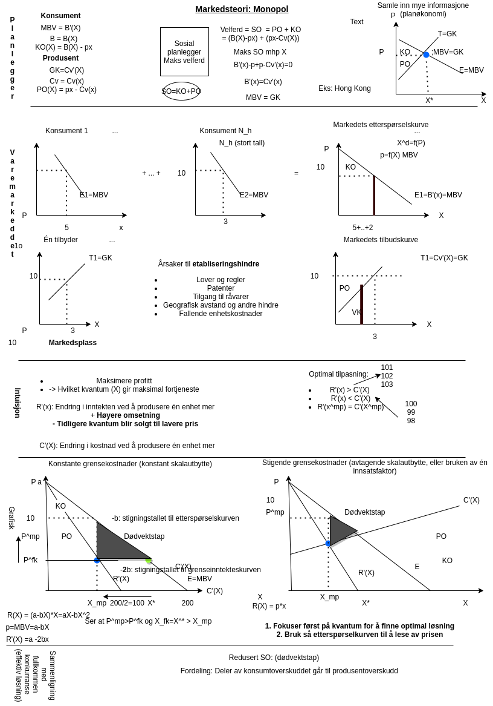
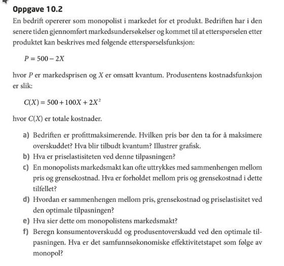

# Forelesning 8:

## DEL 4: MARKEDSTEORI: Monopol

Etableringshindre

-   Forbud mot nyetableringer: postverket, vinmonopolet.

-   Patentrettigheter: eksklusiv rettighet på produkt eller produksjonsteknikk.

-   Kontroll over sentrale produksjonsfaktorer/råvarer.

-   Lokale markeder: butikker som ligger i betydelig avstand eller til hinder for konkurrenter.

-   Stordriftsfordeler. Innebærer fallende enhetskostnader: jernbane (NSB).

### Intuisjon

### Grafisk

### Matematisk forklaring

Inntekten er definert som

$R(X)=px$

Vi antar at den inverse av etterspørselsfunksjonen (MBV) er gitt som en lineær funksjons

$MBV=a-bX$

Ved å sette inn for dette i uttrykket ovenfor, kan inntekten uttrykes som

$R(X)=(a-bX)x=x-bX^{2}$

Vi finner grenseinntekten ved å derivere dette uttrykket

$R'(X)=1-2bX^{2-1}=1-2bX$

Ved konstant skalautbbyte vil grensekostnaden være konstant, for eks. gitt ved

$C'(X)=0.5$

Optimal produksjon for monopolisten vil derfor være gitt ved

$$
I'(X)=C'(X) \Rightarrow 
1-2bX = 1 \\
2bX = 1+1=2 \\
X^{mp}=X=2/2b = 1/b
$$ Ved å sette denne løsningen inn i uttrykket for MBV finner vi monopolprisen

$$
MBV=a-b/b=a-1
$$ Løsningen ovenfor er tilsvarende den man finner som maksimerer bedriftens profitt $$
\text{Maks } \pi = R(X)-C(X)
$$ Som også gir oss førsteordensbetingelsen $$
R'(X)=C'(X)
$$

**Øvelse til neste gangr:**

**Svar**

