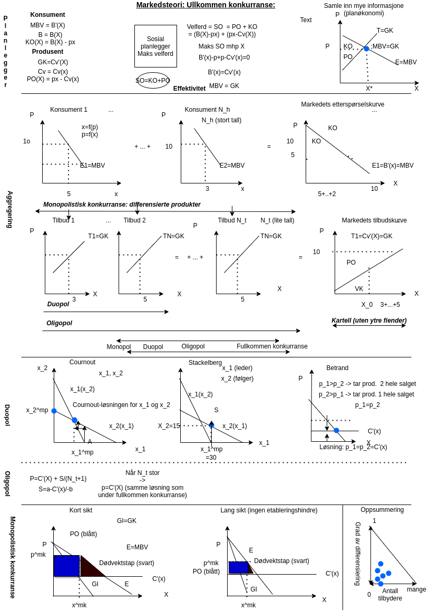

# Forelesning 9:

## DEL 4: MARKEDSTEORI: kartel, duopol, oligopol og monopolistisk konkurranse

```{r, child=c('presentasjon_jih/pre_forelesning_9.Rmd')}
```



[Examples Cournot](https://www.quora.com/What-are-some-real-life-examples-of-the-Cournot-Duopoly-Model?share=1)

